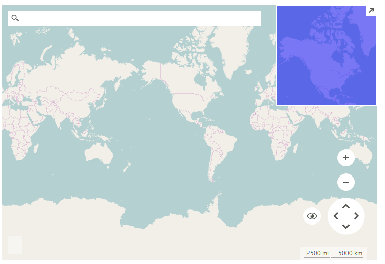

# OpenStreetMapProvider

__RadMap__ can visualize data from the [OpenStreetMaps](http://wiki.openstreetmap.org/wiki/API) REST services.  You can enable tile caching to a local folder setting a new __LocalFileCacheProvider__ to the OpenStreetMapProvider.__CacheProvider__ property.

>caption Figure 1: OpenStreetMapProvider 

#### Using OpenStreetMapProvider

<snippet id='map-osmprovider-useosmprovider-cs' />
<snippet id='map-osmprovider-useosmprovider-vb' />

## Using Encrypted HTTP Version

A __TLS 1.2 SecurityProtocol__ will be required when modifying the RadMap URL to use __https:\\__ while using OpenStreetMapProvider. This protocol automatically comes with .NET Framework 4.7.  For older .NET Frameworks, or because of some other Windows settings, it may be necessary to explicitly choose TLS 1.2 for your application by setting the __System.Net.ServicePointManager.SecurityProtocol__ property to __SecurityProtocolType.Tls12__. Otherwise the tiles won't be donwload while using __https://__. This is further described in the [Transport Layer Security (TLS) best practices with the .NET Framework](https://learn.microsoft.com/en-us/dotnet/framework/network-programming/tls) MSDN article.

<snippet id='map-osmprovider-securityprotocol-cs' />
<snippet id='map-osmprovider-securityprotocol-vb' />

