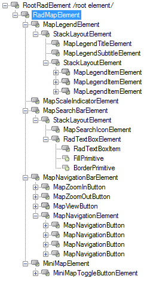
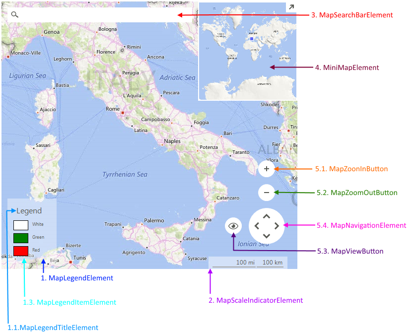

# Structure

This article describes the inner structure and organization of the elements which build the __RadMap__ control.
        
>caption Figure 1: RadMap's elements hierarchy

>caption Figure 2: RadMap visual structure

1. __MapLegendElement__: represents the legend  
  1.1. __MapLegendTitleElement__: represents the legend's title  
  1.2. __MapLedendSubtitleElement__: represents the legend's subtitle  
  1.3. __MapLegendItemElement__: represents a legend's item
2. __MapScaleIndicatorElement__: represents the scale indicator
3. __MapSearchBarElement__: represents the search bar  
  3.1. __MapSearchIconElement__: represents the search icon  
  3.2. __RadTextBoxElement__: represents the search text box
4. __MiniMapElement__: represents the mini map  
  4.1. __MiniMapToggleButtonElement__: represents the mini map expand/collapse button
5. __MapNavigationBarElement__: represents the navigation bar  
  5.1. __MapZoonInButton__: represents the zoom in button  
  5.2. __MapZoomOutButton__: represents the zoom out button  
  5.3. __MapViewButton__: represents the view button  
  5.4. __MapNavigationElement__: represents the navigation element

# See Also
* [Getting Started]()
* [RadControlSpy]()
            
