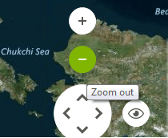
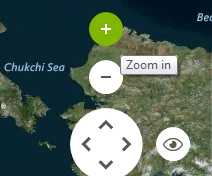

# ToolTips

There are two ways to assign tool tips to elements in __RadMap__, namely setting the __ToolTipText__ property of a __MapVisualElement__, or as in most of the RadControls by using the __ToolTipTextNeeded__ event of __RadMap__.
      

## Setting tool tips of MapVisualElements

The code snippet below demonstrates how you can assign a tool tip to zoom out button in __RadMap__.

#### Using the ToolTipText property

<snippet id='map-mapgettingstarted-mapvisualelementtooltip-cs' />
<snippet id='map-mapgettingstarted-mapvisualelementtooltip-vb' />

>caption Figure 1: Tool tip assigned by using the ToolTipText property

## Setting tool tips in the ToolTipTextNeeded event

The code snippet below demonstrates how you can use __ToolTipTextNeeded__ event handler to set __ToolTipText__ for the given __MapVisualElement__.

#### Using the ToolTipTextNeeded event

<snippet id='map-mapgettingstarted-tooltiptextneeded-cs' />
<snippet id='map-mapgettingstarted-tooltiptextneeded-vb' />

>caption Figure 2: Tool tip assigned by using the ToolTipTextNeeded event

>important The __ToolTipTextNeeded__ event has higher priority and overrides the tool tips set by the __ToolTipText__ property of __MapVisualElements__.
>

