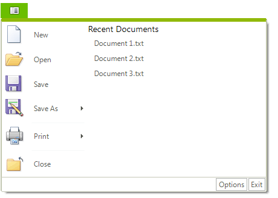

# ApplicationMenu

**RadRibbonBar** combines the functions of menus, tab strips and tool bars to make an interface similar to those introduced in Microsoft Office 2007. With **RadRibbonBar** you can organize all of the functionality of your application into a single compact ribbon. When it is resized, the ribbon bar efficiently shows more or less details as space becomes available. If you use a Multiple Document Interface (MDI) layout, the ribbon bar will automatically manage the child forms.

**RadApplicationMenu** is the Telerik counterpart of the *application menu* that displays controls used to perform actions on entire documents and forms, such as `Save` and `Print`. It also provides a list of recent documents, access to form options, and the ability to exit the form or application.

**RadApplicationMenu** is essentially a **RadDropDownButton** and has many of the same properties and design time interface as a **RadMenu**, i.e. same Smart Tag items, RadItem Collection Editor and the same RadItem types that may be added to the collection. In the case of **RadApplicationMenu**, there are three RadItem collections: **Items**, **RightColumnItems**, and **ButtonItems**. The RightColumnWidth property allows you to reserve extra screen real estate. **RadApplicationMenu** also has a **DisplayStyle** property that may be *Image* (default), *None*, *Text* and *ImageAndText*. Set the **Image** property to include your logo or whatever icon you want to use. The screenshot below shows all three collections populated and the **Image** set to a "world globe" icon.

