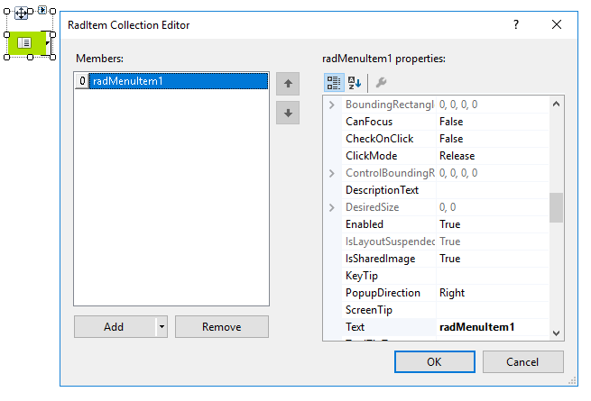
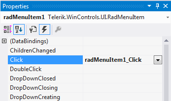

# Getting Started with WinForms ApplicationMenu
 
The following tutorial demonstrates how to populate **RadApplicationMenu** and how to react to a user's choice in code.

1\. Drag **RadApplicationMenu** to a form and click the *Smart Tag*.
            

2\. Click the *Edit Items* button.
            

3\. Add a few items. 
            
>caption Figure 1: Adding items at design time



4\. Apply different images for each item.

5\. In the *Properties* section in Visual Studio select the events button. Select the desired item from the *Properties* drop down and double click the **Click** event.

>caption Figure 2: Generate Click event handler:



6\. Replace the automatically generated event handler with this code:

#### Handling Click event

{{source=..\SamplesCS\Menus\AppMenu\ApplicationMenu.cs region=ItemClick}} 
{{source=..\SamplesVB\Menus\AppMenu\ApplicationMenu.vb region=ItemClick}} 

````C#
private void radMenuItem1_Click(object sender, EventArgs e)
{
    RadMenuItem item = sender as RadMenuItem;
    RadMessageBox.Show(item.Text + " is clicked!");
}

````
````VB.NET
Private Sub RadMenuItem1_Click(sender As Object, e As EventArgs) Handles RadMenuItem1.Click
    Dim item As RadMenuItem = TryCast(sender, RadMenuItem)
    RadMessageBox.Show(item.Text + " is clicked!")
End Sub

````

>caption Figure 2: Handling Click event


# See Also

* [Populating with Data]()
