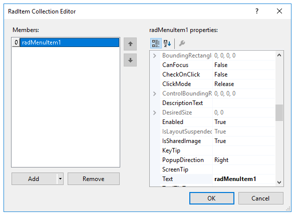
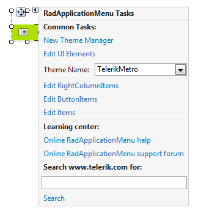
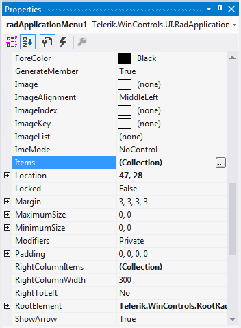
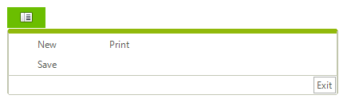

# Populating with Data

This article demonstrates how to populate **RadApplicationMenu** with data either at design time or at run time. 

## Adding Items at Design Time

You can add items at design time by using the *RadItem Collection Editor*.

>caption Figure 1: RadApplicationMenu's  RadItem Collection Editor

You can access it through the *Smart tag >> Edit Items* option:

>caption Figure 2: Smart tag options

By using the *Edit RightColumnItems* and *Edit ButtonItems* options you can add items to the menu's right column and bottom buttons container respectively.

Another possibility to open the editor is via the __Items__ collection in the *Properties* Visual Studio section:

>caption Figure 3:  Visual Studio Properties window

print

## Adding Items Programmatically

**RadApplicationMenu** supports adding items at run time, which means that you can manually populate it with items. The following example demonstrates how to add items to the left and right drop down menu's columns and to the bottom buttons container.

#### Add items programmatically 

<snippet id='menus-applicationmenu-additems-cs' />
<snippet id='menus-applicationmenu-additems-vb' />

>caption Figure 4:  Add Items Programmatically 

