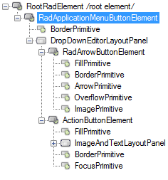
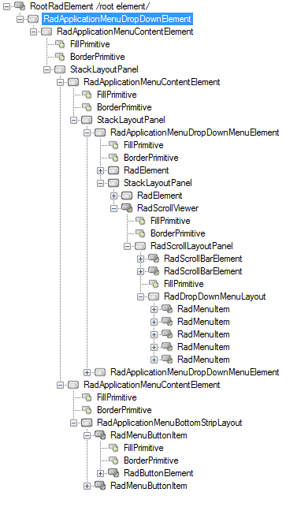
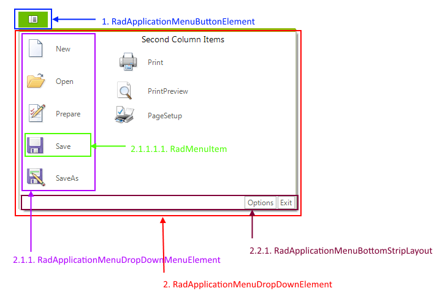

# Structure

This article describes the inner structure and organization of the elements which build the **RadApplicationMenu** control.

>caption Figure 1: RadApplicationMenu's elements hierarchy

        
>caption Figure 2: RadApplicationMenu visual structure

1. **RadApplicationMenuButtonElement**: represents the application menu button element    
  1.1. **DropDownEditorLayoutPanel**   
     &nbsp;&nbsp;&nbsp;&nbsp;1.1.1. **RadArrowButtonElement**: represents the arrow button    
     &nbsp;&nbsp;&nbsp;&nbsp;1.1.2. **ActionButtonElement**: represents the button element
1. **RadApplicationMenuDropDownElement**: represents the drop down  
	2.1. **RadApplicationMenuContentElement**  
		&nbsp;&nbsp;&nbsp;&nbsp;&nbsp;2.1.1. **RadApplicationMenuDropDownMenuElement**: represents the drop down menu content menu element (left and right column)  
			&nbsp;&nbsp;&nbsp;&nbsp;&nbsp;&nbsp;&nbsp;&nbsp;&nbsp;&nbsp;2.1.1.1. **RadDropDownMenuLayout**   
				&nbsp;&nbsp;&nbsp;&nbsp;&nbsp;&nbsp;&nbsp;&nbsp;&nbsp;&nbsp;&nbsp;&nbsp;&nbsp;&nbsp;&nbsp;2.1.1.1.1. **RadMenuItem**: represents a menu item   
	2.2. **RadApplicationMenuContentElement** :   
		&nbsp;&nbsp;&nbsp;&nbsp;2.2.1. **RadApplicationMenuBottomStripLayout**: represents the container that holds bottom button items   
			&nbsp;&nbsp;&nbsp;&nbsp;&nbsp;&nbsp;&nbsp;&nbsp;2.2.1.1. **RadMenuButtonItem**: represents the menu button item.

# See Also

* [RadControlSpy]()
            

