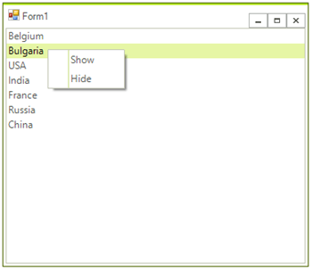

# Add Context menu in the code

This article demonstrates how you can add RadContextMenu in the code and attach it to a specific control. 

1\.	Adding a RadContextMenu at runtime. To programmatically add a RadContextMenu to a form, create a new instance of a RadContextMenu

{{source=..\SamplesCS\Menus\ContextMenu\ContextMenuCode2.cs region=AddMenu}} 
{{source=..\SamplesVB\Menus\ContextMenu\ContextMenuCode2.vb region=AddMenu}} 

{{endregion}} 

2\. Add  RadMenuItems to RadContextMenu.

{{source=..\SamplesCS\Menus\ContextMenu\ContextMenuCode2.cs region=AddItems}} 
{{source=..\SamplesVB\Menus\ContextMenu\ContextMenuCode2.vb region=AddItems}} 

{{endregion}} 

3\.	Subscribe to МouseClick event of the control and call the RadContextMenu.Show() method:

{{source=..\SamplesCS\Menus\ContextMenu\ContextMenuCode2.cs region=AttachToControl}} 
{{source=..\SamplesVB\Menus\ContextMenu\ContextMenuCode2.vb region=AttachToControl}} 

{{endregion}} 

4\.	Here is the result:

