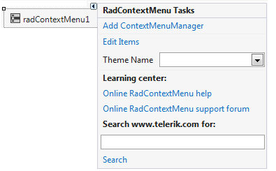
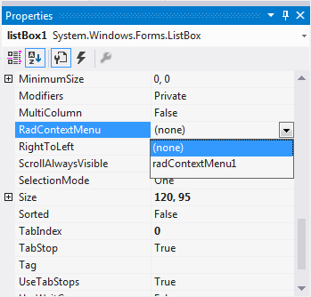
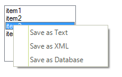

# Assign RadContextMenu to Telerik and non-Telerik controls

You can easily assign a **RadContextMenu** to Telerik and non-Telerik controls. This can be achieved by making use of __RadContextMenuManager__ component. This component will add a __RadContextMenu__ property to all controls on the form. Then, you should simply set a __RadContextMenu__ instance to the __RadContextMenu__ property.

In the example below we are assigning __RadContextMenu__ to __RadListControl__ and Microsoft __ListBox__:

1. Drop a __RadContextMenu__ component on your form and add several __RadMenuItems__ to it.

1. Drop __RadListControl__ and Microsoft __ListBox__ on the form.

1. Select the __RadContextMenu__ component and click its __Smart Tag__. From the Action Menu click on the __Add ContextMenuManager__ option. This will create a __RadContextMenuManager__ instance and will add a __RadContextMenu__ property to all the controls on our form. 
	
	

1. Select __RadListControl__ and __Microsoft ListBox__ controls and set their __RadContextMenu__ property to the **RadContextMenu** instance.

	

1. Run the project. When you right click on the __ListBox__ or __RadListControl__ the __RadContextMenu__ instance will be displayed.

	

# See Also
* [Distinguishing the Source Control of RadContextMenu]()
