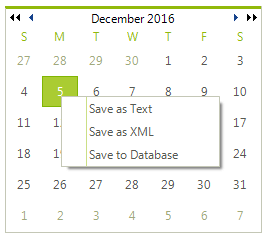

# Context Menus

To implement context menus use __RadContextMenu__ in your application. __RadContextMenu__ is a non-visual component that sits in the component tray located below the form design surface. __RadContextMenu__, like __RadMenu__, can be themed and has an items collection that accepts __RadMenuItem__, __RadMenuComboBoxItem__, __RadMenuSeparatorItem__ and __RadMenuContextItem__. 

>caption Figure 1: RadContextMenu



There are two ways to attach a context menu to a given control or portion of a control: 

* For those **RadControls** that have a __ContextMenu__ or __RadContextMenu__ properties you can assign the __RadContextMenu__ in the designer or in code.

#### Assigning a RadContextMenu

{{source=..\SamplesCS\Menus\ContextMenu\ContextMenu1.cs region=assignToTreeView}} 
{{source=..\SamplesVB\Menus\ContextMenu\ContextMenu1.vb region=assignToTreeView}} 

````C#
radTreeView1.Nodes[0].ContextMenu = radContextMenu1;

````
````VB.NET
RadTreeView1.Nodes(0).ContextMenu = RadContextMenu1

````

{{endregion}} 

>important The __ContextMenuStrip__ property refers to a Windows standard control. This property drop down will not display __RadMenu__ or __RadContextMenu__ components that exist on the form.
>


* Handle the mouse down event for the control that requires the context menu and call the RadContextMenu.__Show()__ method.

#### Handling the MouseDown event

{{source=..\SamplesCS\Menus\ContextMenu\ContextMenu1.cs region=mouseDown}} 
{{source=..\SamplesVB\Menus\ContextMenu\ContextMenu1.vb region=mouseDown}} 

````C#
void radCalendar1_MouseDown(object sender, MouseEventArgs e)
{
    if (e.Button == MouseButtons.Right)
    {
        Point p = (sender as Control).PointToScreen(e.Location);
        radContextMenu1.Show(p.X, p.Y);
    }
}

````
````VB.NET
Private Sub radCalendar1_MouseDown(ByVal sender As Object, ByVal e As MouseEventArgs)
    If e.Button = MouseButtons.Right Then
        Dim p As Point = (TryCast(sender, Control)).PointToScreen(e.Location)
        RadContextMenu1.Show(p.X, p.Y)
    End If
End Sub

````

{{endregion}} 

# See Also

* [Assign RadContextMenu to Telerik and non-Telerik controls]()


