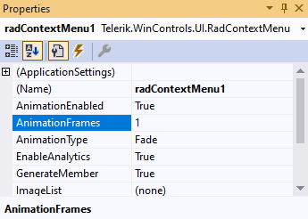

# Properties

|Property|Description|
|----|----|
|**Items**|Gets menu items collection.|
|**ImageList**|Gets or sets the ImageList that contains the images displayed by this control.|
|**DropDown**|Gets menu drop down panel.|

As of **R1 2022 SP1** the animation-related properties are exposed directly on the context-menu:

## Methods

|Method|Description|
|----|----|
|**Show()**|Displays the context menu in its default position.|
|**Show(int x, int y)**|Displays the context menu relative to the specified screen x,y coordinates.|
|**Show(Point point)**|Displays the context menu relative to the specified screen location.|
|**Show(Point point, RadDirection popupDirection)**|Positions the context menu relative to the specified screen location and with the specified direction.|
|**Show(Control control, int x, int y)**|Positions the context menu relative to the specified control x,y coordinates.|
|**Show(Control control, Point point)**|Positions the context menu relative to the specified control location.|
|**Show(Control control, Point point, RadDirection popupDirection)**|Positions the context menu relative to the specified control location and with the specified direction.|
|**Show(RadItem item, int x, int y)**|Positions the context menu relative to the specified RadItem x,y coordinates.|
|**Show(RadItem item, Point point)**|Positions the context menu relative to the specified RadItem location.|
|**Show(RadItem item, Point point, RadDirection popupDirection)**|Positions the context menu relative to the specified RadItem location and with the specified direction.|
|**Show(RadItem item, int ownerOffset, RadDirection popupDirection)**|Positions the context menu relative to the specified RadItem location and with specified direction and offset according to the owner.|

## Events

|Event|Description|
|----|----|
|**DropDownOpening**|Occurs when the drop down is opening.|
|**DropDownClosing**|Occurs when the drop down is closing.|
|**DropDownOpened**|Occurs when the drop down is opened.|
|**DropDownClosed**|Occurs when the drop down is closed.|

# See Also

* [Properties](https://docs.telerik.com/devtools/winforms/api/telerik.wincontrols.ui.radcontextmenu.html#properties)
* [Methods](https://docs.telerik.com/devtools/winforms/api/telerik.wincontrols.ui.radcontextmenu.html#methods)
* [Events](https://docs.telerik.com/devtools/winforms/api/telerik.wincontrols.ui.radcontextmenu.html#events)

