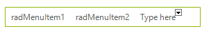
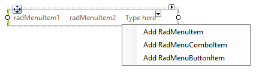
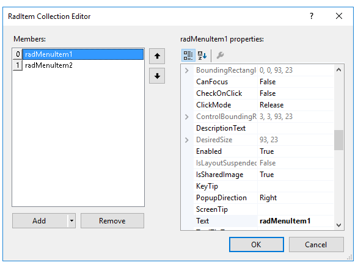
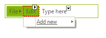
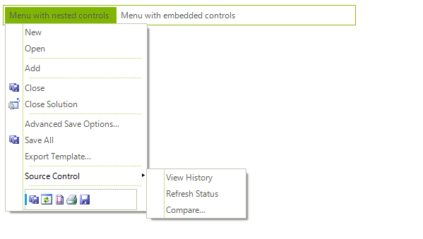

# Menu Designer
 
## Adding Main Menu items

There are multiple methods for building menus using the RadItem Collection Editor or the **RadMenu** designer. To add a new main menu item:

* Click the **RadMenu** area labeled *Type here*, and type your top level menu item directly into the entry space provided. When you're finished click `ESC` to abandon your edits or `Enter` to accept the edits and create a new __RadMenuItem__. 

* Click the drop-down arrow to the right of the existing main menu items, and select *Add RadMenuItem*,  *Add RadMenuComboItem* or *Add RadMenuSeparatorItem* to create an item of the corresponding type. Once the menu item is created you can use the [Smart Tag]() to configure the __Text__, __Image__ properties and edit the __Items__ collection for the menu item.

* Click the **RadMenu** control, open its [Smart Tag]() menu, and select __Edit Items__. Add a new __RadMenuItem__ in the __RadItem Collection Editor__.

>note The menu designer is decorated with rightward and downward pointing arrow buttons. Right-pointing arrows  indicate [Smart Tags]() for the __RadMenu__ and the Down-pointing arrows let you add a particular menu item type, i.e. __RadMenuItem__ , __RadMenuComboItem__ or __RadMenuSeparatorItem__ .
>

## Adding Sub Menu Items

To add a new sub-menu item to a main menu item, use one of these procedures:

* Select the main menu item, click in its __Items__ property, click the ellipsis button, and then use the *RadItem Collection Editor*. 

* Click a main menu item in the designer to invoke the __Add new__ item. __Add new__ will allow you to select from __RadMenuitem__, __RadMenuComboItem__ or __RadmenuSeparatorItem__. Select one of these menu item types to create it and add it below the selected menu item.

Each __RadMenuItem__ can have its own items to allow menu designs that require multiple levels of hierarchy.

## Removing Menu Items

To remove a main menu or sub-menu item, select the item and press `Delete` or right click the menu item and select __Delete__ from the context menu.

# See Also

* [Smart Tag]()
* [Getting Started]()	