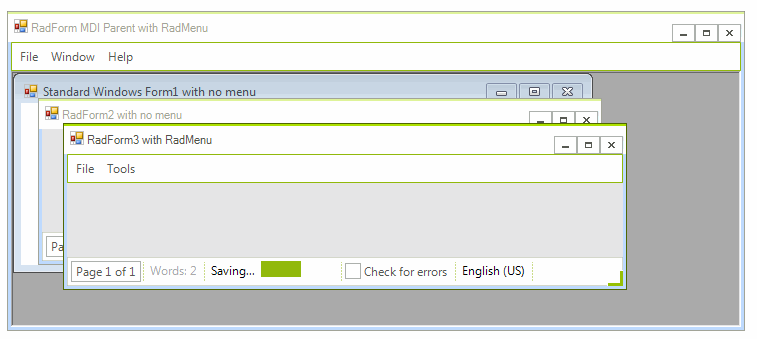

# MDI list

**RadMenuItem(s)** have a Boolean property called __MdiList__. If it is set to *true*, the item is in the first level of the hierarchy, and the item is located in a parent MDI form, this item becomes a MDI list for the application. This means that all child  MDI forms will appear in it as items and a click on such item activates the corresponding form. 

The screenshot below demonstrates the concept. In this case, there are two forms, namely Form1 and Form2. The *Window* menu item's **MdiList** property is set to *true*, so the separator item and the Form1, Form2 items are added automatically *after* all items in this menu item. 

If the user clicks on Form1 in the menu, Form1 gets activated.

>caption Figure 1: MDI List

# See Also

* [Menu Merge in MDI applications]()	
* [Menu Merge]()	
* [MDI forms]()	