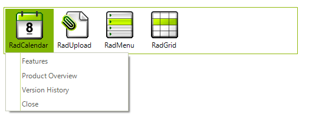
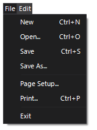
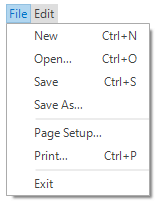
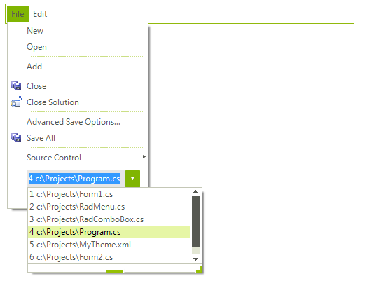
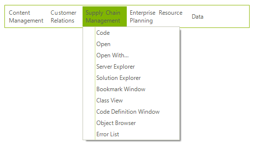

# WinForms Menu Overview

**RadMenu** enables you to integrate attractive and flexible menus on Forms within your Windows applications.





>caption Figure 1: RadMenu

In addition to all the capabilities of the standard Windows Forms MenuStrip control, **RadMenu** enables additional       advanced capabilities for your applications. 

# Key Features       

* Full support for the Telerik UI for WinForms theming engine allowing you to easily construct a variety of stunning visual effects. The drop down can be animated with a number of predefined effects.

* Nesting of any other Telerik RadControl within a **RadMenu**, allowing you to create a menu with an embedded text box or combo box.

* Menu item text displayed in a variety of formats, such as using multi-line text, and vertical or horizontal orientation.
            

* Images can be displayed in the background of the menu as a whole and for each menu item.

## Telerik UI for WinForms Learning Resources
* [Telerik UI for WinForms Menu Homepage](https://www.telerik.com/products/winforms/menus.aspx)
* [Get Started with the Telerik UI for WinForms Menu]()
* [Telerik UI for WinForms API Reference](https://docs.telerik.com/devtools/winforms/api/)
* [Getting Started with Telerik UI for WinForms Components]()
* [Telerik UI for WinForms Virtual Classroom (Training Courses for Registered Users)](https://learn.telerik.com/learn/course/external/view/elearning/17/TelerikUIforWinForms) 
* [Telerik UI for WinForms Forum](https://www.telerik.com/forums/winforms)
* [Telerik UI for WinForms Knowledge Base](https://docs.telerik.com/devtools/winforms/knowledge-base)

## Telerik UI for WinForms Additional Resources
* [Telerik UI for WinForms Product Overview](https://www.telerik.com/products/winforms.aspx)
* [Telerik UI for WinForms Blog](https://www.telerik.com/blogs/desktop-winforms)
* [Telerik UI for WinForms Videos](https://www.telerik.com/videos/product/winforms)
* [Telerik UI for WinForms Roadmap](https://www.telerik.com/support/whats-new/winforms/roadmap)
* [Telerik UI for WinForms Pricing](https://www.telerik.com/purchase/individual/winforms.aspx)
* [Telerik UI for WinForms Code Library](https://www.telerik.com/support/code-library/winforms)
* [Telerik UI for WinForms Support](https://www.telerik.com/support/winforms)
* [What’s New in Telerik UI for WinForms](https://www.telerik.com/support/whats-new/winforms)

## See Also

* [Structure]()	
* [Getting Started]()	
