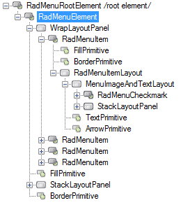
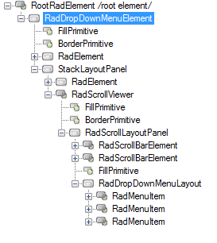
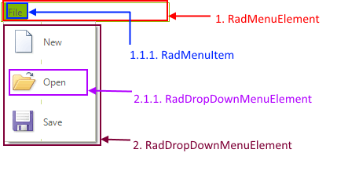

# Structure

This article describes the inner structure and organization of the elements which build the **RadMenu** control.

>caption Figure 1: RadMenu's elements hierarchy

        
>caption Figure 2: RadMenu visual structure

1. **RadMenuElement**    
	1\.1\. **WrapLayoutPanel**       
		&nbsp;&nbsp;&nbsp;1\.1\.1\. **RadMenuItem**          
							&nbsp;&nbsp;&nbsp;&nbsp;&nbsp;&nbsp;1\.1\.1\.1\. **FillPrimitive**       
							&nbsp;&nbsp;&nbsp;&nbsp;&nbsp;&nbsp;1\.1\.1\.2\. **BorderPrimitive**      
							&nbsp;&nbsp;&nbsp;&nbsp;&nbsp;&nbsp;1\.1\.1\.3\. **RadMenuItemLayout**   
2. **RadDropDownMenuElement**  
	2\.1\. **RadDropDownMenuLayout**   
		&nbsp;&nbsp;&nbsp;2\.1\.1\. **RadMenuItem**

# See Also

* [RadControlSpy]()
* [Getting Started]()	
