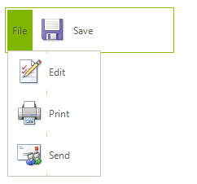
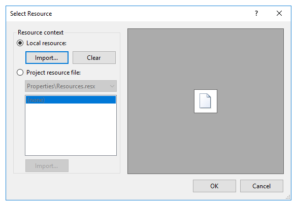
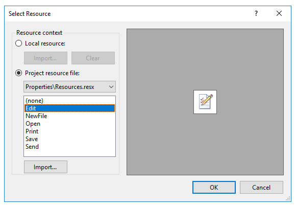
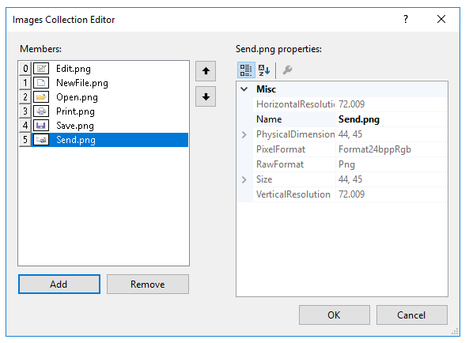
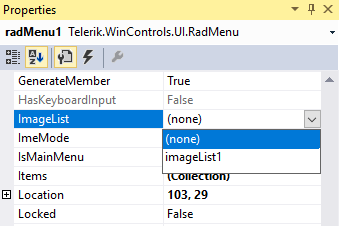
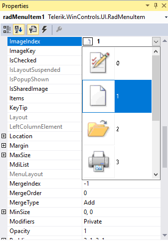

# Menu Item Images 

Images can be placed in both the main and sub menu items. Images can be added directly to each RadMenuItem.__Image__ property through local and project resources or can be supplied by an __ImageList__ component.

## Local Resources

To use an image from a local resource click the __RadMenuItem__ and in the Property window click the __Images__ property ellipses. In the __Select Resource__ dialog select the __Local resource__ radio button, then click the __Import...__ button. In the __Open__ dialog navigate to an image file ("gif", "jpg", "bmp", "wmf" or "png") select the file and click the __Open__ button. The image will display in the __Select Resource__ dialog preview window. Click __OK__ to close the dialog. The image will now display in the menu item.

## Project Resources

To use an image from a project resource click the __RadMenuItem__ and in the *Properties* window click the __Images__ property ellipses. In the __Select Resource__ dialog select the __Project resource file__ radio button, then click the __Import...__ button. In the __Open__ dialog navigate to an image file ("gif", "jpg", "bmp", "wmf" or "png") select the file and click the __Open__ button. The image will display in the __Select Resource__ dialog preview window and in the list of resources. Also notice that in the Solution Explorer a "resources" folder is added automatically that contains the new image file. Click __OK__ to close the dialog. The image will now display in the menu item.

## Using an ImageList

For consistent management of multiple images that can be used by more than one control at a time use the Windows standard __ImageList__ component. The __ImageListSmart Tag__ allows: 

* Sizing all images at one time, so you can increase the __Image Size__ from the default 16 x 16 pixels up to 256 x 256. The example at the beginning of this topic shows a 64 x 64 image.

>note At increased image sizes the images will scale, but may not be attractive depending on the original resolution of the image.
>

* Increase the __Image Bit Depth__ up to 32 bit.

* __Choose images__.

Click the Smart Tag __Choose images__ link to open the __Images Collection Editor__ dialog. Click the **Add** button to display the __Open__ dialog. In the __Open__ dialog navigate to an image file ("gif", "jpg", "bmp", "wmf" or "png"), select the file and click the __Open__ button. The image will display in the __Images Collection Editor Members__ list. When you have selected all the images that will be in the menu, click __OK__ to close the dialog.

Set the RadMenu.__ImageList__ property using the drop down provided in the *Properties* Window. The drop down will pick up any **ImageList** components you have added to the form.

Use the __ImageIndex__ or __ImageKey__ properties to select the image supplied by the ImageList.__ImageIndex__ locates the image by the integer position within the list. __ImageKey__ locates the image using a string key value.

# See Also

* [Menu Orientation]()	
* [Menu Background  and Background Image]()	
* [Animation Effects]()	
