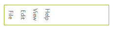
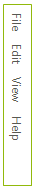
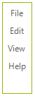

# Menu Orientation

The __Orientation__ property of the **RadMenu** control and the __TextOrientation__ and __FlipText__ properties of the individual **RadMenuItems** interact to determine the overall layout of the **RadMenu**.

## Default Menu

The __RadMenu__ default settings are: __Orientation__ = *Horizontal*, __TextOrientation__ = *Horizontal*, __FlipText__ = *false*. The resulting menu is arranged as shown in the figure below:

#### Default Orientation

<snippet id='menus-menuorientation-default-cs' />
<snippet id='menus-menuorientation-default-vb' />

## Horizontal Menu with Vertical Items

The menu can be oriented horizontally with menu items arranged vertically:

#### Vertical Text Orientation

<snippet id='menus-menuorientation-textvertical-cs' />
<snippet id='menus-menuorientation-textvertical-vb' />

## Sideways Menu

The menu can be oriented vertically with menu items arranged horizontally to create a "sideways" menu:

#### Vertical Menu With Horizontal Text

<snippet id='menus-menuorientation-menuvertical-cs' />
<snippet id='menus-menuorientation-menuvertical-vb' />

## Stacked Vertical Menu

#### Vertical Menu With Vertical Text

<snippet id='menus-menuorientation-textmenuvertical-cs' />
<snippet id='menus-menuorientation-textmenuvertical-vb' />

# See Also

* [Menu Item Images]()	
* [Menu Background  and Background Image]()	
* [Animation Effects]()		
