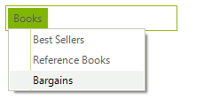
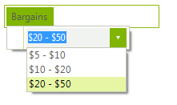

# Adding and Removing Items

## Adding Menu Items

In order to add top level "main" menu items use the RadMenu.__Items__ collection and the RadMenuItem.__Items__ collection for sub menu items. Here are a few examples using overloads of the __RadMenuItem__. The first uses a parameter-less constructor, assigns the RadMenuItem.__Text__ property and finally adds the menu item to the RadMenu.__Items__ collection. The second example uses the easiest way to include and add menu items all at one time where a constructor that has a single string __Text__ parameter. The last example uses a constructor with a second object __Tag__ parameter that you can store any arbitrary data in.

>caption Figure 1: Adding menu items


#### Constructing and adding menu items

{{source=..\SamplesCS\Menus\Menu\MenuForm.cs region=menuItems}} 
{{source=..\SamplesVB\Menus\Menu\MenuForm.vb region=menuItems}} 

````C#
RadMenuItem cdItem = new RadMenuItem();
cdItem.Text = "CDs";
radMenu1.Items.Add(cdItem);
radMenu1.Items.Add(new RadMenuItem("Books"));
int someData = 123;
RadMenuItem dvdItem = new RadMenuItem("DVDs", someData);
radMenu1.Items.Add(dvdItem);

````
````VB.NET
Dim cdItem As New RadMenuItem()
cdItem.Text = "CDs"
RadMenu1.Items.Add(cdItem)
RadMenu1.Items.Add(New RadMenuItem("Books"))
Dim someData As Integer = 123
Dim dvdItem As New RadMenuItem("DVDs", someData)
RadMenu1.Items.Add(dvdItem)

````

{{endregion}} 

## Adding Sub Menu Items

Adding sub menu items plays by the same rules as adding items to the RadMenu.__Items__ collection except here we use the **Items** collection of another __RadMenuItem__. In the code example below a reference to the first menu item *Books* is retrieved and several __RadMenuItems__ are added to the *Books* menu __Items__ collection. Also notice that a **Click** event handler is attached to the last *Bargains* menu item.

>caption Figure 2: Adding sub menu items



#### Adding menu sub items

{{source=..\SamplesCS\Menus\Menu\MenuForm.cs region=subItems}} 
{{source=..\SamplesVB\Menus\Menu\MenuForm.vb region=subItems}} 

````C#
void Form1_Load(object sender, EventArgs e)
{
    radMenu1.Items.Add(new RadMenuItem("Books"));
    RadMenuItem item = radMenu1.Items[0] as RadMenuItem;
    item.Items.Add(new RadMenuItem("Best Sellers"));
    item.Items.Add(new RadMenuItem("Reference Books"));
    RadMenuItem bargainItem = new RadMenuItem("Bargains");
    bargainItem.Click += new EventHandler(menuItem_Click);
    item.Items.Add(bargainItem);
}
void menuItem_Click(object sender, EventArgs e)
{
    RadMenuItem item = (sender as RadMenuItem);
    MessageBox.Show(item.Text + " was clicked.");
}

````
````VB.NET
Private Sub Form1_Load(ByVal sender As Object, ByVal e As EventArgs)
    RadMenu1.Items.Add(New RadMenuItem("Books"))
    Dim item As RadMenuItem = TryCast(RadMenu1.Items(0), RadMenuItem)
    item.Items.Add(New RadMenuItem("Best Sellers"))
    item.Items.Add(New RadMenuItem("Reference Books"))
    Dim bargainItem As New RadMenuItem("Bargains")
    AddHandler bargainItem.Click, AddressOf menuItem_Click
    item.Items.Add(bargainItem)
End Sub
Private Sub menuItem_Click(ByVal sender As Object, ByVal e As EventArgs)
    Dim item As RadMenuItem = (TryCast(sender, RadMenuItem))
    MessageBox.Show(item.Text & " was clicked.")
End Sub

````

{{endregion}} 

## Adding a RadMenuComboItem

**RadMenuComboItems** are constructed with no parameters and then the ComboBoxElement.__Items__ collection is used to populate the drop-down list.

>caption Figure 3: Adding combo item



#### Adding combo sub item

{{source=..\SamplesCS\Menus\Menu\MenuForm.cs region=comboItem}} 
{{source=..\SamplesVB\Menus\Menu\MenuForm.vb region=comboItem}} 

````C#
RadMenuItem bargainItem = new RadMenuItem("Bargains");
RadMenuComboItem comboItem = new RadMenuComboItem();
comboItem.ComboBoxElement.Items.Add(new RadListDataItem("$5 - $10"));
comboItem.ComboBoxElement.Items.Add(new RadListDataItem("$10 - $20"));
comboItem.ComboBoxElement.Items.Add(new RadListDataItem("$20 - $50"));
bargainItem.Items.Add(comboItem);
radMenu1.Items.Add(bargainItem);

````
````VB.NET
Dim bargainItem As New RadMenuItem("Bargains")
Dim comboItem As New RadMenuComboItem()
comboItem.ComboBoxElement.Items.Add(New RadListDataItem("$5 - $10"))
comboItem.ComboBoxElement.Items.Add(New RadListDataItem("$10 - $20"))
comboItem.ComboBoxElement.Items.Add(New RadListDataItem("$20 - $50"))
bargainItem.Items.Add(comboItem)
RadMenu1.Items.Add(bargainItem)

````

{{endregion}} 

## Performance

For best performance when performing long running operations, such as loading a number of menu items from a database, call the __BeginInit()__ and __EndInit()__ methods to suspend layout of the menu. 

#### Suspending the layout

{{source=..\SamplesCS\Menus\Menu\MenuForm.cs region=performance}} 
{{source=..\SamplesVB\Menus\Menu\MenuForm.vb region=performance}} 

````C#
radMenu1.BeginInit();
// ... perform operations
radMenu1.EndInit();

````
````VB.NET
RadMenu1.BeginInit()
' ... perform operations
RadMenu1.EndInit()

````

{{endregion}}

## Removing Menu Items

Remove items from the items collection using __Remove()__ or __RemoveAt()__ methods. __RemoveAt()__ takes integer position of the item in the collection, __Remove()__ takes a reference to the menu item to be removed.

#### Removing items

{{source=..\SamplesCS\Menus\Menu\MenuForm.cs region=removingItems}} 
{{source=..\SamplesVB\Menus\Menu\MenuForm.vb region=removingItems}} 

````C#
// remove second item in collection
radMenu1.Items.RemoveAt(1);
// Remove the zero-ith ite
radMenu1.Items.Remove(radMenu1.Items[0]);

````
````VB.NET
' remove second item in collection
RadMenu1.Items.RemoveAt(1)
' Remove the zero-ith ite
RadMenu1.Items.Remove(RadMenu1.Items(0))

````

{{endregion}}

# See Also

* [RadMenuItem]()
* [Nesting Controls in Menu Items]()	 