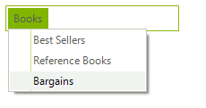
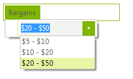

# Adding and Removing Items

## Adding Menu Items

In order to add top level "main" menu items use the RadMenu.__Items__ collection and the RadMenuItem.__Items__ collection for sub menu items. Here are a few examples using overloads of the __RadMenuItem__. The first uses a parameter-less constructor, assigns the RadMenuItem.__Text__ property and finally adds the menu item to the RadMenu.__Items__ collection. The second example uses the easiest way to include and add menu items all at one time where a constructor that has a single string __Text__ parameter. The last example uses a constructor with a second object __Tag__ parameter that you can store any arbitrary data in.

>caption Figure 1: Adding Menu Items

#### Constructing and adding menu items

<snippet id='menus-menuform-menuitems-cs' />
<snippet id='menus-menuform-menuitems-vb' />

## Adding Sub Menu Items

Adding sub menu items plays by the same rules as adding items to the RadMenu.__Items__ collection except here we use the **Items** collection of another __RadMenuItem__. In the code example below a reference to the first menu item *Books* is retrieved and several __RadMenuItems__ are added to the *Books* menu __Items__ collection. Also notice that a **Click** event handler is attached to the last *Bargains* menu item.

>caption Figure 2: Adding Sub Menu Items

<snippet id='menus-menuform-subitems-cs' />
<snippet id='menus-menuform-subitems-vb' />

## Adding a RadMenuComboItem

**RadMenuComboItems** are constructed with no parameters and then the ComboBoxElement.__Items__ collection is used to populate the drop-down list.

>caption Figure 3: Adding Combo Item

#### Adding Combo Sub Item

<snippet id='menus-menuform-comboitem-cs' />
<snippet id='menus-menuform-comboitem-vb' />

## Performance

For best performance when performing long running operations, such as loading a number of menu items from a database, call the __BeginInit()__ and __EndInit()__ methods to suspend layout of the menu. 

#### Suspending the layout

<snippet id='menus-menuform-performance-cs' />
<snippet id='menus-menuform-performance-vb' />

## Removing Menu Items

Remove items from the items collection using __Remove()__ or __RemoveAt()__ methods. __RemoveAt()__ takes integer position of the item in the collection, __Remove()__ takes a reference to the menu item to be removed.

#### Removing items

<snippet id='menus-menuform-removingitems-cs' />
<snippet id='menus-menuform-removingitems-vb' />

# See Also

* [RadMenuItem]()
* [Nesting Controls in Menu Items]()	 
