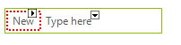
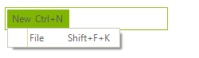
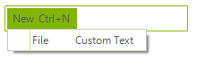

# Assign Shortcuts to Menu Items

The following tutorial demonstrates how to assign a shortcut to a **RadMenuItem**:

1\. In a new Windows Application add a **RadMenu** to the form.

2\. On the **RadMenu** that reads "*Type here*" enter *New*. This will automatically create a menu item object "radMenuItem1":



3\. Click the newly created item to open the drop down menu and create a sub menu item. By default, the text of the new item will be set to *radMenuItem2*. Change it to *File*:


4\. In the Properties Window locate the **Click** events for radMenuItem1 and radMenuItem2 and double-click them to create event handlers.

5\. Inside the event handlers add the following code:

#### RadMenuItems Click event handlers

{{source=..\SamplesCS\Shortcuts\Form2.cs region=handlingClickEvent}} 
{{source=..\SamplesVB\Shortcuts\Form2.vb region=handlingClickEvent}} 

````C#
void radMenuItem1_Click(object sender, EventArgs e)
{
    MessageBox.Show("New");
}
void radMenuItem2_Click(object sender, EventArgs e)
{
    MessageBox.Show("File");
}

````
````VB.NET
Private Sub radMenuItem1_Click(ByVal sender As Object, ByVal e As EventArgs)
    MessageBox.Show("New")
End Sub
Private Sub radMenuItem2_Click(ByVal sender As Object, ByVal e As EventArgs)
    MessageBox.Show("File")
End Sub

````

{{endregion}} 

6\. Now all you have to do is to add the shortcuts to the desired items

#### Adding shortcuts to menu items

{{source=..\SamplesCS\Shortcuts\Form2.cs region=menuShortcuts}} 
{{source=..\SamplesVB\Shortcuts\Form2.vb region=menuShortcuts}} 

````C#
this.radMenuItem1.Shortcuts.Add(new RadShortcut(Keys.Control, Keys.N));
this.radMenuItem2.Shortcuts.Add(new RadShortcut(Keys.Shift, Keys.F, Keys.K));

````
````VB.NET
Me.RadMenuItem1.Shortcuts.Add(New RadShortcut(Keys.Control, Keys.N))
Me.RadMenuItem2.Shortcuts.Add(New RadShortcut(Keys.Shift, Keys.F, Keys.K))

````

{{endregion}} 

>note In the constructor of **RadShortcut**, you should first pass the key modifier as a parameter and then an array of the key mappings.
>

As a result, you will get this picture runtime. As you can see, the shortcuts are automatically displayed for the **RadMenuItems**:



Interesting functionality to mention is the ability to set your own custom text to describe the shortcut added. This can be achieved via the __HintText__ property of the menu item:

#### Assigning HintText

{{source=..\SamplesCS\Shortcuts\Form2.cs region=SetHintText}} 
{{source=..\SamplesVB\Shortcuts\Form2.vb region=SetHintText}} 

````C#
radMenuItem2.HintText = "Custom Text";

````
````VB.NET
RadMenuItem2.HintText = "Custom Text"

````

{{endregion}} 



# See Also

* [Adding and Removing Items]()
* [Nesting Controls in Menu Items]()	
* [RadMenuItem Events]()	
* [Multi-Line Menu Item Text]()