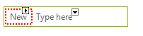
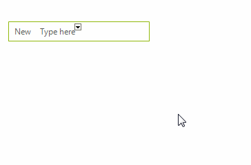
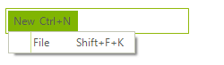
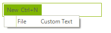

# Assign Shortcuts to Menu Items

The following tutorial demonstrates how to assign a shortcut to a **RadMenuItem**:

1\. In a new Windows Application add a **RadMenu** to the form.

2\. On the **RadMenu** that reads "*Type here*" enter *New*. This will automatically create a menu item object "radMenuItem1":

3\. Click the newly created item to open the drop down menu and create a sub menu item. By default, the text of the new item will be set to *radMenuItem2*. Change it to *File*:

4\. In the Properties Window locate the **Click** events for radMenuItem1 and radMenuItem2 and double-click them to create event handlers.

5\. Inside the event handlers add the following code:

#### RadMenuItems Click event handlers

<snippet id='menus-form2-handlingclickevent-cs' />
<snippet id='menus-form2-handlingclickevent-vb' />

6\. Now all you have to do is to add the shortcuts to the desired items

#### Adding shortcuts to menu items

<snippet id='menus-form2-menushortcuts-cs' />
<snippet id='menus-form2-menushortcuts-vb' />

>note In the constructor of **RadShortcut**, you should first pass the key modifier as a parameter and then an array of the key mappings.
>

As a result, you will get this picture runtime. As you can see, the shortcuts are automatically displayed for the **RadMenuItems**:

Interesting functionality to mention is the ability to set your own custom text to describe the shortcut added. This can be achieved via the __HintText__ property of the menu item:

#### Assigning HintText

<snippet id='menus-form2-sethinttext-cs' />
<snippet id='menus-form2-sethinttext-vb' />

# See Also

* [Adding and Removing Items]()
* [Nesting Controls in Menu Items]()	
* [RadMenuItem Events]()	
* [Multi-Line Menu Item Text]()
