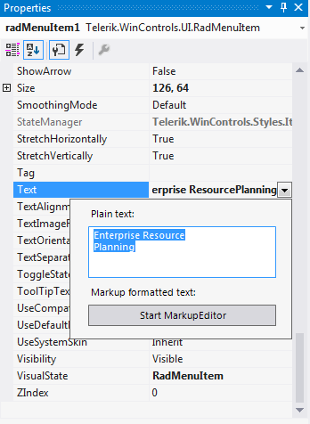

# Multi-Line Menu Item Text

The RadMenuItem.__Text__ property can be displayed on multiple lines as shown in the screenshot below. 


In the Properties Window for a __RadMenuItem__ use the drop down list to invoke the editor for multiple lines. __Ctrl+Enter__ creates a new line in the editor. __Esc__ cancels changes and closes the editor. 



In code use __Environment.NewLine__ to separate strings:

{{source=..\SamplesCS\Menus\Menu\MenuForm.cs region=multiline}} 
{{source=..\SamplesVB\Menus\Menu\MenuForm.vb region=multiline}} 

````C#
radMenuItem1.Text = "Bar Chart - " +
 Environment.NewLine +
 "Compare multiple series of data";

````
````VB.NET
radMenuItem1.Text = "Bar Chart - " & Environment.NewLine & "Compare multiple series of data"

````

{{endregion}} 

## Menu Item Height

The __AllItemsEqualHeight__ property controls whether the **RadMenu** allows some menu items to be higher than others. By default, menu items with multiple lines of text are higher than menu items with single lines of text. If you set this property to *true*, the height of all items increases to match that of the tallest items.

{{source=..\SamplesCS\Menus\Menu\WorkingWithRadMenuItems\MultilineMenuItemText.cs region=Height}} 
{{source=..\SamplesVB\Menus\Menu\WorkingWithRadMenuItems\MultilineMenuItemText.vb region=Height}} 

````C#
radMenu1.AllItemsEqualHeight = true;

````
````VB.NET
radMenu1.AllItemsEqualHeight = True

````

{{endregion}} 

# See Also

* [Adding and Removing Items]()
* [Nesting Controls in Menu Items]()	
* [RadMenuItem Events]()	
* [Assign Shortcuts to Menu Items]()


