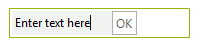
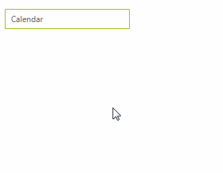

# Nesting RadElements in Menu Items

The __RadMenuContentItem__ is a container menu item that allows you to build up custom menu items from other elements. You can assign any **RadElement** to the __ContentElement__ property of a **RadMenuContentItem**. The example below demonstrates how to dynamically create two main menu items that contain __RadTextBoxElement__ and __RadButtonElement__. When the button is clicked a message box displays the text.

>caption Figure 1: Hosting RadElements in menu items



#### Adding content items

{{source=..\SamplesCS\Menus\Menu\NestingControls.cs region=nestingControls}} 
{{source=..\SamplesVB\Menus\Menu\NestingControls.vb region=nestingControls}} 

````C#
void Form1_Load(object sender, EventArgs e)
{
    RadMenuContentItem textBoxContentItem = new RadMenuContentItem();
    RadTextBoxElement textBox = new RadTextBoxElement();
    textBox.Text = "Enter text here";
    textBox.MinSize = new Size(100, 0);
    textBoxContentItem.ContentElement = textBox; 
    radMenu1.Items.Add(textBoxContentItem);
    RadMenuContentItem buttonContentItem = new RadMenuContentItem();
    RadButtonElement button = new RadButtonElement();
    button.Text = "OK";
    button.Click += new EventHandler(button_Click);
    buttonContentItem.ContentElement = button; 
    radMenu1.Items.Add(buttonContentItem);
}
void button_Click(object sender, EventArgs e)
{
    RadTextBoxElement textBox = radMenu1.Items[0] as RadTextBoxElement;
    MessageBox.Show("Text is: " + textBox.Text);
}

````
````VB.NET
Private Sub Form1_Load(ByVal sender As Object, ByVal e As EventArgs)
    Dim textBoxContentItem As New RadMenuContentItem()
    Dim textBox As New RadTextBoxElement()
    textBox.Text = "Enter text here"
    textBox.MinSize = New Size(100, 0)
    textBoxContentItem.ContentElement = textBox
    RadMenu1.Items.Add(textBoxContentItem)
    Dim buttonContentItem As New RadMenuContentItem()
    Dim button As New RadButtonElement()
    button.Text = "OK"
    buttonContentItem.ContentElement = button
    RadMenu1.Items.Add(buttonContentItem)
End Sub
Private Sub button_Click(ByVal sender As Object, ByVal e As EventArgs)
    Dim textBox As RadTextBoxElement = TryCast(RadMenu1.Items(0), RadTextBoxElement)
    MessageBox.Show("Text is: " & textBox.Text)
End Sub

````

{{endregion}} 

# Nesting RadControls in Menu Items
 
This tutorial demonstrates adding a **RadPageView** to a **RadMenu**. Each page will contain a populated drop down list. Clicking the drop down list items displays a message box with the current selection text. 

>caption Figure 2: Hosting RadControls in menu items



1\. Add a __RadMenu__ to the form. No other design time work needs to be done.

2\. Add the necessary items definitions along with a string array for the months and seasons.

{{source=..\SamplesCS\Menus\Menu\NestingControlsTutorial.cs region=data}} 
{{source=..\SamplesVB\Menus\Menu\NestingControlsTutorial.vb region=data}} 

````C#
private RadDropDownList seasonDropDownList;
private RadDropDownList monthDropDownList;
private RadPageView pageView;
private string[] months = new string[]
{
            "January", "February", "March", "April", "May",
            "June", "July", "August", "September", "October",
            "November", "December", "January"
};
private string[] seasons = new string[] { "Spring", "Summer", "Fall", "Winter" };

````
````VB.NET
Private seasonDropDownList As RadDropDownList
Private monthDropDownList As RadDropDownList
Private pageView As RadPageView
Private months() As String = {"January", "February", "March", "April", "May", "June", "July", "August", "September", "October", "November", "December", "January"}
Private seasons() As String = {"Spring", "Summer", "Fall", "Winter"}

````

{{endregion}} 

3\. Create a private method that builds and returns a __RadDropDownList__. In addition, you can display the selected item text by using the **SelectedIndexChanged** event.

{{source=..\SamplesCS\Menus\Menu\NestingControlsTutorial.cs region=CreaateDDL}} 
{{source=..\SamplesVB\Menus\Menu\NestingControlsTutorial.vb region=CreaateDDL}} 

````C#
private RadDropDownList CreateRadDropDownListElement(string text, string[] captions)
{
    RadDropDownList ddl = new RadDropDownList();
    ddl.Location = new Point(15, 15);
    ddl.Size = new Size(150, 19);
    ddl.Margin = new Padding(25, 5, 5, 5);
    ddl.Text = text;
    foreach (string caption in captions)
    {
        ddl.Items.Add(new RadListDataItem(caption));
    }
    ddl.SelectedIndexChanged += ddl_SelectedIndexChanged;
    return ddl;
}
void ddl_SelectedIndexChanged(object sender, Telerik.WinControls.UI.Data.PositionChangedEventArgs e)
{
    RadListDataItem item =
        (sender as RadDropDownList).SelectedItem;
    MessageBox.Show(item.Text);
}

````
````VB.NET
Private Function CreateRadDropDownListElement(ByVal text As String, ByVal captions() As String) As RadDropDownList
    Dim ddl As New RadDropDownList()
    ddl.Location = New Point(15, 15)
    ddl.Size = New Size(150, 19)
    ddl.Margin = New Padding(25, 5, 5, 5)
    ddl.Text = text
    For Each caption As String In captions
        ddl.Items.Add(New RadListDataItem(caption))
    Next caption
    AddHandler ddl.SelectedIndexChanged, AddressOf ddl_SelectedIndexChanged
    Return ddl
End Function
Private Sub ddl_SelectedIndexChanged(ByVal sender As Object, ByVal e As Telerik.WinControls.UI.Data.PositionChangedEventArgs)
    Dim item As RadListDataItem = (TryCast(sender, RadDropDownList)).SelectedItem
    MessageBox.Show(item.Text)
End Sub

````

{{endregion}} 

4\. Create a form's __Load__ event handler. In addition, you should add the event prevent the drop down from closing when one is working with the page view. The exit item can be used for closing the drop down in this case.

{{source=..\SamplesCS\Menus\Menu\NestingControlsTutorial.cs region=main}} 
{{source=..\SamplesVB\Menus\Menu\NestingControlsTutorial.vb region=main}} 

````C#
private void Form1_Load(object sender, EventArgs e)
{
    monthDropDownList = CreateRadDropDownListElement("Select Month", months);
    seasonDropDownList = CreateRadDropDownListElement("Select Season", seasons);
    RadMenuItem rmiSettings = new RadMenuItem("Calendar");
    rmiSettings.DropDownClosing += rmiSettings_DropDownClosing;
    radMenu1.Items.Add(rmiSettings);
    rmiSettings.Items.Add(new RadMenuItem("Options"));
    RadMenuItem closeItem = new RadMenuItem("Exit");
    closeItem.Click += closeItem_Click;
    rmiSettings.Items.Add(closeItem);
    this.pageView = new RadPageView();
    this.pageView.Size = new System.Drawing.Size(300, 100);
    RadPageViewStripElement stripElement = this.pageView.ViewElement as RadPageViewStripElement;
    stripElement.ItemFitMode = StripViewItemFitMode.None;
    stripElement.StripButtons = StripViewButtons.None;
    RadPageViewPage montsPage = new RadPageViewPage("Month");
    RadPageViewPage seasonsPage = new RadPageViewPage("Season");
    montsPage.Controls.Add(monthDropDownList);
    seasonsPage.Controls.Add(seasonDropDownList);
    pageView.Pages.Add(montsPage);
    pageView.Pages.Add(seasonsPage);
    RadMenuHostItem hostItem = new RadMenuHostItem(pageView);
    hostItem.MinSize = new System.Drawing.Size(210, 50);
    rmiSettings.Items.Insert(1, hostItem);
}
void closeItem_Click(object sender, EventArgs e)
{
    RadMenuItem item = (RadMenuItem)sender;
    RadMenuItem parent = item.HierarchyParent as RadMenuItem;
    parent.DropDown.ClosePopup(new PopupCloseInfo(RadPopupCloseReason.CloseCalled, this));
}
void rmiSettings_DropDownClosing(object sender, RadPopupClosingEventArgs args)
{
    args.Cancel = args.CloseReason == RadPopupCloseReason.Mouse;
}

````
````VB.NET
Private Sub Form1_Load(ByVal sender As Object, ByVal e As EventArgs)
    monthDropDownList = CreateRadDropDownListElement("Select Month", months)
    seasonDropDownList = CreateRadDropDownListElement("Select Season", seasons)
    Dim rmiSettings As New RadMenuItem("Calendar")
    AddHandler rmiSettings.DropDownClosing, AddressOf rmiSettings_DropDownClosing
    radMenu1.Items.Add(rmiSettings)
    rmiSettings.Items.Add(New RadMenuItem("Options"))
    Dim closeItem As New RadMenuItem("Exit")
    AddHandler closeItem.Click, AddressOf closeItem_Click
    rmiSettings.Items.Add(closeItem)
    Me.pageView = New RadPageView()
    Me.pageView.Size = New System.Drawing.Size(300, 100)
    Dim stripElement As RadPageViewStripElement = TryCast(Me.pageView.ViewElement, RadPageViewStripElement)
    stripElement.ItemFitMode = StripViewItemFitMode.None
    stripElement.StripButtons = StripViewButtons.None
    Dim montsPage As New RadPageViewPage("Month")
    Dim seasonsPage As New RadPageViewPage("Season")
    montsPage.Controls.Add(monthDropDownList)
    seasonsPage.Controls.Add(seasonDropDownList)
    pageView.Pages.Add(montsPage)
    pageView.Pages.Add(seasonsPage)
    Dim hostItem As New RadMenuHostItem(pageView)
    hostItem.MinSize = New System.Drawing.Size(210, 50)
    rmiSettings.Items.Insert(1, hostItem)
End Sub
Private Sub closeItem_Click(ByVal sender As Object, ByVal e As EventArgs)
    Dim item As RadMenuItem = DirectCast(sender, RadMenuItem)
    Dim parent As RadMenuItem = TryCast(item.HierarchyParent, RadMenuItem)
    parent.DropDown.ClosePopup(New PopupCloseInfo(RadPopupCloseReason.CloseCalled, Me))
End Sub
Private Sub rmiSettings_DropDownClosing(ByVal sender As Object, ByVal args As RadPopupClosingEventArgs)
    args.Cancel = args.CloseReason = RadPopupCloseReason.Mouse
End Sub

````

{{endregion}} 

This **Load** event handler performs the main work of the application. 

* A __RadDropDpwnList__ is created and populated with the months of the year.
                

* A second __RadDropDpwnList__ is created and populated with the names of the seasons.
                

* A main __RadMenuItem__ *Calendar* is created with two token menu items *Options* and *Exit*.
                

* A __RadMenuHostItem__ is created to contain the page view.
                

* A __RadPageView__ is created. Two pages are added to the page view. Each one contains the corresponding drop down list. Then, the page view is added to the __RadMenuHostItem__. In this example the drop down lists are providing choices while the pages allows the tabs to be switched.

* The __RadMenuHostItem__ is inserted into the second position in the menu.

Press `F5` to run the application. Notice the behavior when clicking the tabs and when clicking the items in the combo boxes.
 

## See Also

* [RadMenuItem]()
* [Adding and Removing Items]()
 
