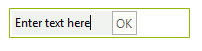
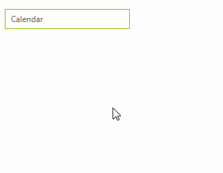

# Nesting RadElements in Menu Items

The __RadMenuContentItem__ is a container menu item that allows you to build up custom menu items from other elements. You can assign any **RadElement** to the __ContentElement__ property of a **RadMenuContentItem**. The example below demonstrates how to dynamically create two main menu items that contain __RadTextBoxElement__ and __RadButtonElement__. When the button is clicked a message box displays the text.

>caption Figure 1: Hosting RadElements in menu items

#### Adding content items

<snippet id='menus-nestingcontrols-nestingcontrols-cs' />
<snippet id='menus-nestingcontrols-nestingcontrols-vb' />

# Nesting RadControls in Menu Items
 
This tutorial demonstrates adding a **RadPageView** to a **RadMenu**. Each page will contain a populated drop down list. Clicking the drop down list items displays a message box with the current selection text. 

>caption Figure 2: Hosting RadControls in menu items

1\. Add a __RadMenu__ to the form. No other design time work needs to be done.

2\. Add the necessary items definitions along with a string array for the months and seasons.

<snippet id='menus-nestingcontrolstutorial-data-cs' />
<snippet id='menus-nestingcontrolstutorial-data-vb' />

3\. Create a private method that builds and returns a __RadDropDownList__. In addition, you can display the selected item text by using the **SelectedIndexChanged** event.

<snippet id='menus-nestingcontrolstutorial-creaateddl-cs' />
<snippet id='menus-nestingcontrolstutorial-creaateddl-vb' />

4\. Create a form's __Load__ event handler. In addition, you should add the event prevent the drop down from closing when one is working with the page view. The exit item can be used for closing the drop down in this case.

<snippet id='menus-nestingcontrolstutorial-main-cs' />
<snippet id='menus-nestingcontrolstutorial-main-vb' />

This **Load** event handler performs the main work of the application. 

* A __RadDropDpwnList__ is created and populated with the months of the year.
                

* A second __RadDropDpwnList__ is created and populated with the names of the seasons.
                

* A main __RadMenuItem__ *Calendar* is created with two token menu items *Options* and *Exit*.
                

* A __RadMenuHostItem__ is created to contain the page view.
                

* A __RadPageView__ is created. Two pages are added to the page view. Each one contains the corresponding drop down list. Then, the page view is added to the __RadMenuHostItem__. In this example the drop down lists are providing choices while the pages allows the tabs to be switched.

* The __RadMenuHostItem__ is inserted into the second position in the menu.

Press `F5` to run the application. Notice the behavior when clicking the tabs and when clicking the items in the combo boxes.
 

## See Also

* [RadMenuItem]()
* [Adding and Removing Items]()
 
