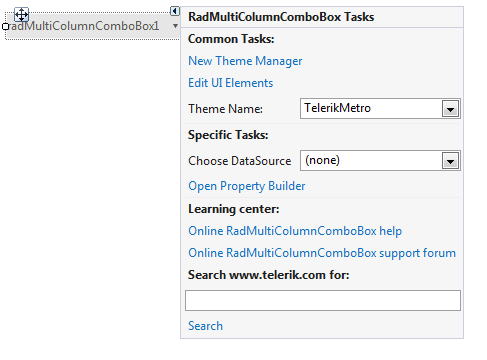
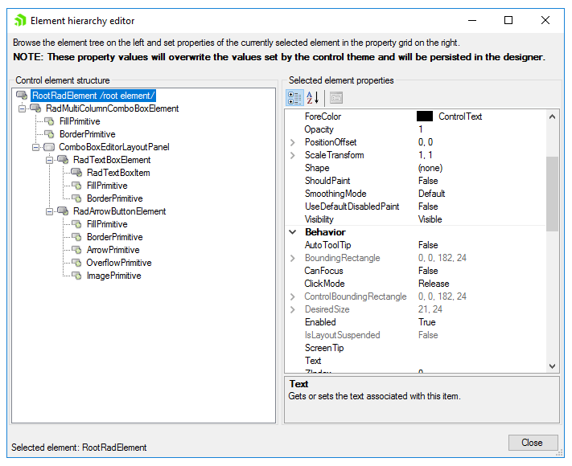

# Design Time

To start using **RadMultiColumnComboBox** just drag it from the toolbox and drop it at the form.
 
## Smart Tag

Select **RadMultiColumnComboBox** and click the small arrow on the top right position in order to open the __Smart Tag__. The __Smart Tag__ for **RadMultiColumnComboBox** lets you quickly access common tasks involved with building **RadMultiColumnComboBox** elements and customizing appearance through themes.

>caption Figure 1: Smart Tag

* __New Theme Manager__: adds a new __RadThemeManager__ component to the form.
            

* __Edit UI Elements__: allows setting properties at multiple levels of the class hierarchy.
            
>caption Figure 2: Element Hierarchy Editor

* __Theme Name__: select a theme name from the drop down list of themes available for that control. Selecting a theme allows you to change all aspects of the control's visual style at one time.

* __DataSource__: allows binding **RadMultiColumnComboBox** at design time.
            
* __Open Property Builder__: allows quickly creating and arranging node structure and appearance.

           
* __Learning Center__: Navigate to the Telerik help, code library projects or support forum.

* __Search__: Search the Telerik site for a given string.         

## Data Binding

You can bind **RadMultiColumnComboBox** at design time by specifying the __DataSource__, __ValueMember__ and __DisplayMember__ properties. Additional information can be found on the following link: [Data binding at design time]().   
        
# See Also

* [Element Hierarchy Editor]()
* [Using default themes]()

 

