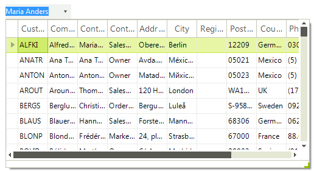
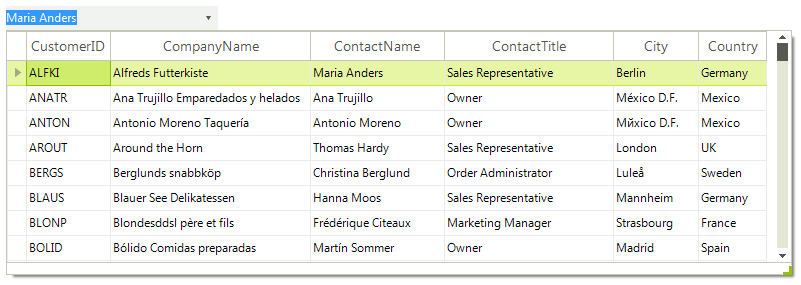

# Drop Down Properties

This article lists all important properties that are relevant for the drop down in **RadMultiColumnComboBox**.

## DropDownWidth

The **DropDownWidth** property gets or sets the width of the of the drop-down portion of **RadMultiColumnComboBox**.

#### Setting the DropDownWidth property

{{source=..\SamplesCS\MultiColumnComboBox\MultiColumnComboBox1.cs region=dropDownHeight}} 
{{source=..\SamplesVB\MultiColumnComboBox\MultiColumnComboBox1.vb region=dropDownHeight}} 

````C#
            
this.radMultiColumnComboBox1.MultiColumnComboBoxElement.DropDownWidth = 500;

````
````VB.NET
Me.RadMultiColumnComboBox1.MultiColumnComboBoxElement.DropDownWidth = 500

````

{{endregion}}

>caption Figure 1: DropDownWidth



## DropDownHeight

The **DropDownHeight** property gets or sets the height in pixels of the drop-down portion of **RadMultiColumnComboBox**.

#### Setting the DropDownHeight property

{{source=..\SamplesCS\MultiColumnComboBox\MultiColumnComboBox1.cs region=dropDownWidth}} 
{{source=..\SamplesVB\MultiColumnComboBox\MultiColumnComboBox1.vb region=dropDownWidth}} 

````C#
            
this.radMultiColumnComboBox1.MultiColumnComboBoxElement.DropDownHeight = 500;

````
````VB.NET
Me.RadMultiColumnComboBox1.MultiColumnComboBoxElement.DropDownHeight = 500

````

{{endregion}}

>caption Figure 2: DropDownHeight


## AutoSizeDropDownToBestFit

It determines whether the drop-down portion of the control will be auto-sized to best fit all columns. The __DropDownWidth__ property must be set to its default value (-1) to allow this setting to work properly.

>caption Figure 3: AutoSizeDropDownToBestFit



#### AutoSizeDropDownToBestFit

The **AutoSizeDropDownToBestFit** property determines whether the drop-down portion of the control will be auto-sized to best fit all columns. The DropDownWidth property must be set to its default value (-1) to allow this setting to work properly.

#### Autosize the drop down and best-fitting columns

{{source=..\SamplesCS\MultiColumnComboBox\MultiColumnComboBox1.cs region=AutoSizeDropDownToBestFit}} 
{{source=..\SamplesVB\MultiColumnComboBox\MultiColumnComboBox1.vb region=AutoSizeDropDownToBestFit}} 

````C#
this.radMultiColumnComboBox1.AutoSizeDropDownToBestFit = true;

````
````VB.NET
 
Me.RadMultiColumnComboBox1.AutoSizeDropDownToBestFit = True

````

{{endregion}}

## AutoSizeDropDownColumnMode

You can customize the auto-size execution of the algorithm by setting the __AutoSizeDropDownColumnMode__ property:

* __BestFitColumnMode.None__: The column width does not automatically adjust.

* __BestFitColumnMode.AllCells__: The column width adjusts to fit the contents all cells in the control.

* __BestFitColumnMode.DisplayedDataCells__: The column width adjusts to fit the contents of the displayed data cells.     

* __BestFitColumnMode.HeaderCells__: The column width adjusts to fit the contents of the header cell.

* __BestFitColumnMode.FilterCells__: The column width adjusts to fit the contents of the filter cell.

* __BestFitColumnMode.SummaryRowCells__: The column width adjusts to fit the contents of the summary row cell.

* __BestFitColumnMode.SystemCells__: The column width adjusts to fit the contents of the system cells.

* __BestFitColumnMode.DisplayedCells__: The column width adjusts to fit the contents of the displayed cells.
