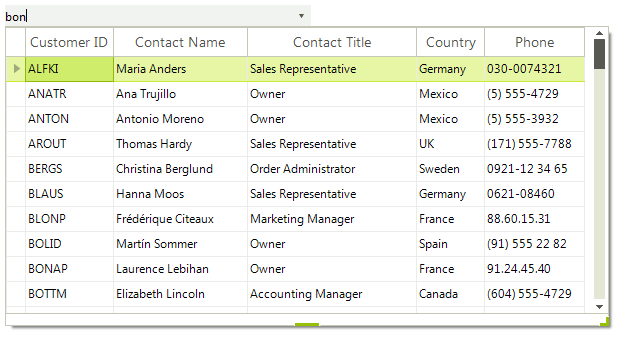
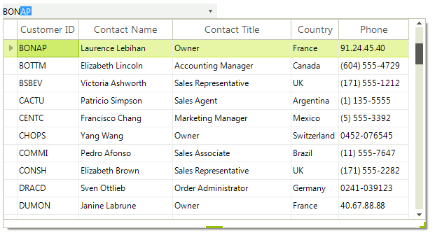

# Auto-Complete

**RadMultiColumnComboBox** provides flexible auto-completion options that suggests and appends text from the available in the list options as the user types.
         
The __AutoCompleteMode__ property controls the auto-complete behavior and can be set to *None, Suggest, Append* and *SuggestAppend*:
        

* __None__: Nothing happens when a user begins to type into the text box portion of the control.
 
>caption Figure 1: AutoCompleteMode.None



{{source=..\SamplesCS\MultiColumnComboBox\AutoCompleteMultiColumnComboBox.cs region=AutoCompleteMode.None}} 
{{source=..\SamplesVB\MultiColumnComboBox\AutoCompleteMultiColumnComboBox.vb region=AutoCompleteMode.None}} 

````C#
this.radMultiColumnComboBox1.AutoCompleteMode = AutoCompleteMode.None;

````
````VB.NET
Me.RadMultiColumnComboBox1.AutoCompleteMode = AutoCompleteMode.None

````

{{endregion}} 

* __Append__: As the user types, the next item in the list that matches the user input is automatically appended to the characters the user has already typed. The popup is not shown without the user clicking the arrow.

>caption Figure 2: AutoCompleteMode.Append



{{source=..\SamplesCS\MultiColumnComboBox\AutoCompleteMultiColumnComboBox.cs region=AutoCompleteMode.Append}} 
{{source=..\SamplesVB\MultiColumnComboBox\AutoCompleteMultiColumnComboBox.vb region=AutoCompleteMode.Append}} 

````C#
this.radMultiColumnComboBox1.AutoCompleteMode = AutoCompleteMode.Append;

````
````VB.NET
Me.RadMultiColumnComboBox1.AutoCompleteMode = AutoCompleteMode.Append

````

{{endregion}} 

* __Suggest__: The following article shows how this functionality can be achieved: [Auto Filter]().
