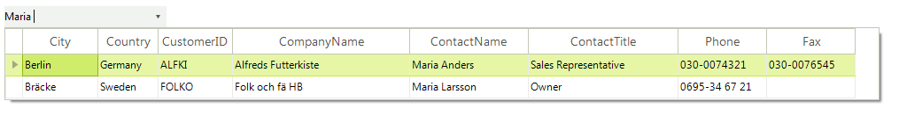

# Filtering

**RadMultiColumnComboBox** supports auto-complete option with suggesting the available result records. This is achieved by the [filtering]() functionality that **RadGridView** supports.

>important The built-in filtering mechanism relies on the field names of the columns in the underlying grid. The property name of an applied filter descriptor needs to match the **FieldName** property of an existing column in the grid.
>

## Using simple FilterDescriptors

Filtering operation in __RadMultiColumnComboBox__ is controlled by the Boolean __AutoFilter__ property. The data is filtered by the field specified as __DisplayMember__. In addition, you should set the filter expression (notifying the control about the rules it should use to filter the data) and add that expression to the __MasterTemplate__.

>important Please note that by default the FilterDescriptor.Value is an empty string and it should remain with this value.
>

#### FilterDescriptor

{{source=..\SamplesCS\MultiColumnComboBox\MultiColumnComboBox1.cs region=filtering}} 
{{source=..\SamplesVB\MultiColumnComboBox\MultiColumnComboBox1.vb region=filtering}} 

````C#
            
this.radMultiColumnComboBox1.AutoFilter = true;
this.radMultiColumnComboBox1.DisplayMember = "ContactName";
FilterDescriptor filter = new FilterDescriptor();
filter.PropertyName = this.radMultiColumnComboBox1.DisplayMember;
filter.Operator = FilterOperator.Contains;
this.radMultiColumnComboBox1.EditorControl.MasterTemplate.FilterDescriptors.Add(filter);

````
````VB.NET
Me.RadMultiColumnComboBox1.AutoFilter = True
Me.RadMultiColumnComboBox1.DisplayMember = "ContactName"
Dim filter As New FilterDescriptor()
filter.PropertyName = Me.RadMultiColumnComboBox1.DisplayMember
filter.Operator = FilterOperator.Contains
Me.RadMultiColumnComboBox1.EditorControl.MasterTemplate.FilterDescriptors.Add(filter)

````

{{endregion}} 

The code snippet above will result in the following multi-column combobox: 

>caption Figure 1: Basic filtering



## Using CompositeFilterDescriptor

You can filter data records by multiple values. For this purpose you have to use the [CompositeFilterDescriptor]() object. It contains a collection of filter descriptors objects and the logical operator for that filters.

>caption Figure 2: Filtering with CompositeFilterDescriptors


{{source=..\SamplesCS\MultiColumnComboBox\MultiColumnComboBox1.cs region=CompositeFilters}} 
{{source=..\SamplesVB\MultiColumnComboBox\MultiColumnComboBox1.vb region=CompositeFilters}} 

````C#
this.radMultiColumnComboBox1.AutoFilter = true;
CompositeFilterDescriptor compositeFilter = new CompositeFilterDescriptor();           
FilterDescriptor prodName = new FilterDescriptor("ProductName", FilterOperator.Contains, "");
FilterDescriptor prodQuantity = new FilterDescriptor("QuantityPerUnit", FilterOperator.Contains, "");
compositeFilter.FilterDescriptors.Add(prodName);
compositeFilter.FilterDescriptors.Add(prodQuantity);
compositeFilter.LogicalOperator = FilterLogicalOperator.Or;
this.radMultiColumnComboBox1.EditorControl.FilterDescriptors.Add(compositeFilter);

````
````VB.NET
Me.radMultiColumnComboBox1.AutoFilter = True
Dim compositeFilter As New CompositeFilterDescriptor()
Dim prodName As New FilterDescriptor("ProductName", FilterOperator.Contains, "")
Dim prodQuantity As New FilterDescriptor("QuantityPerUnit", FilterOperator.Contains, "")
compositeFilter.FilterDescriptors.Add(prodName)
compositeFilter.FilterDescriptors.Add(prodQuantity)
compositeFilter.LogicalOperator = FilterLogicalOperator.[Or]
Me.radMultiColumnComboBox1.EditorControl.FilterDescriptors.Add(compositeFilter)

````

{{endregion}} 

>caution The composite filters allow you to create more complex filtering expressions. Note that this feature is supported for text columns only as the __RadMultiColumnComboBox__ has one common text input for the filtering operation and it is not possible to convert input data to different data formats automatically.
>


# See Also

* [Auto-Complete]()	