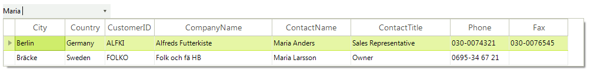

# Filtering

**RadMultiColumnComboBox** supports auto-complete option with suggesting the available result records. This is achieved by the [filtering]() functionality that **RadGridView** supports.

>important The built-in filtering mechanism relies on the field names of the columns in the underlying grid. The property name of an applied filter descriptor needs to match the **FieldName** property of an existing column in the grid.
>

## Using Simple FilterDescriptors

Filtering operation in __RadMultiColumnComboBox__ is controlled by the Boolean __AutoFilter__ property. The data is filtered by the field specified as __DisplayMember__. In addition, you should set the filter expression (notifying the control about the rules it should use to filter the data) and add that expression to the __MasterTemplate__.

>important Please note that by default the FilterDescriptor.Value is an empty string and it should remain with this value.
>

#### FilterDescriptor

<snippet id='multicolumncombobox-multicolumncombobox1-filtering-cs' />
<snippet id='multicolumncombobox-multicolumncombobox1-filtering-vb' />

The code snippet above will result in the following multi-column combobox: 

>caption Figure 1: Basic filtering

## Using CompositeFilterDescriptor

You can filter data records by multiple values. For this purpose you have to use the [CompositeFilterDescriptor]() object. It contains a collection of filter descriptors objects and the logical operator for that filters.

>caption Figure 2: Filtering with CompositeFilterDescriptors

<snippet id='multicolumncombobox-multicolumncombobox1-compositefilters-cs' />
<snippet id='multicolumncombobox-multicolumncombobox1-compositefilters-vb' />

>caution The composite filters allow you to create more complex filtering expressions. Note that this feature is supported for text columns only as the __RadMultiColumnComboBox__ has one common text input for the filtering operation and it is not possible to convert input data to different data formats automatically.
>

# See Also

* [Auto-Complete]()	

* [How to Use GridView Filter Row in RadMultiColumnCombobox]()

* [User-Defined Values in RadMultiColumnComboBox]()	
