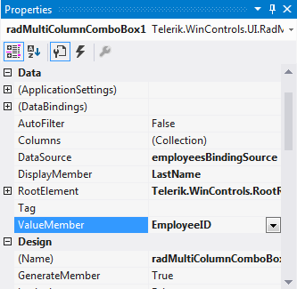
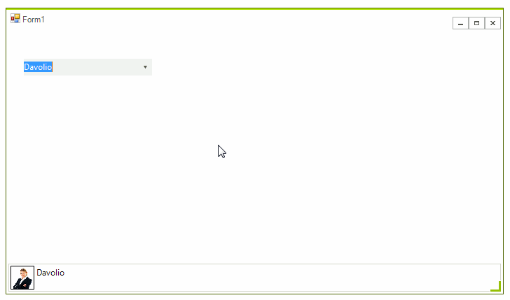

# Getting Started with WinForms MultiColumnComboBox

This tutorial will help you to quickly get started using the control.

## Adding Telerik Assemblies Using NuGet

To use `RadMultiColumnComboBox` when working with NuGet packages, install the `Telerik.UI.for.WinForms.AllControls` package. The [package target framework version may vary]().

Read more about NuGet installation in the [Install using NuGet Packages]() article.

>tip With the 2025 Q1 release, the Telerik UI for WinForms has a new licensing mechanism. You can learn more about it [here]().

## Adding Assembly References Manually

When dragging and dropping a control from the Visual Studio (VS) Toolbox onto the Form Designer, VS automatically adds the necessary assemblies. However, if you're adding the control programmatically, you'll need to manually reference the following assemblies:

* __Telerik.Licensing.Runtime__
* __Telerik.WinControls__
* __Telerik.WinControls.GridView__
* __Telerik.WinControls.UI__
* __TelerikCommon__

The Telerik UI for WinForms assemblies can be install by using one of the available [installation approaches](). 

## Defining the RadMultiColumnComboBox

The following tutorial demonstrates how to setup **RadMultiColumnComboBox** and retrieve the selected text and image.

1\. Add a **RadMultiColumnComboBox** and a **RadStatusStrip** to a **RadForm**.  
2\. By using the Visual Studio *Properties* grid and the *Data Source Configuration Wizard*, set the **DataSource**, **ValueMember** and **DisplayMember** properties of **RadMultiColumnComboBox**. Thus, **RadMultiColumnComboBox** will be bound to the Northwind.Employees table.

3\. Add a **RadImageButtonElement** and a **RadLabelElement** to the **RadStatusStrip**.
4\. In the Visual Studio *Properties* grid, select the **Events** tab and double click the **SelectedIndexChanged** event in order to generate an event handler.

<snippet id='multicolumncombobox-mccbgettingstarted-gettingstarted-cs' />
<snippet id='multicolumncombobox-mccbgettingstarted-gettingstarted-vb' />

5\. Open the **Property Builder** by using the **Smart Tag** and uncheck some of the columns in order to control which columns to be visible.
6\. Press `F5` to run the application and change the selection in **RadMultiColumnComboBox**.

## See Also
* [Design Time]()	
* [Data Binding]()	

## Telerik UI for WinForms Learning Resources
* [Telerik UI for WinForms MultiColumnComboBox Component](https://www.telerik.com/products/winforms/multicolumncombo.aspx)
* [Getting Started with Telerik UI for WinForms Components](https://docs.telerik.com/devtools/winforms/getting-started/first-steps)
* [Telerik UI for WinForms Setup](https://docs.telerik.com/devtools/winforms/installation-and-upgrades/installing-on-your-computer)
* [Telerik UI for WinForms Converter](https://www.telerik.com/products/winforms/documentation/ai-coding-assistant/converter/converter)
* [Telerik UI for WinForms Visual Studio Templates](https://docs.telerik.com/devtools/winforms/visual-studio-integration/visual-studio-templates)
* [Deploy Telerik UI for WinForms Applications](https://docs.telerik.com/devtools/winforms/deployment-and-distribution/application-deployment)
* [Telerik UI for WinForms Virtual Classroom(Training Courses for Registered Users)](https://learn.telerik.com/learn/course/external/view/elearning/17/telerik-ui-for-winforms)
* [Telerik UI for WinForms License Agreement)](https://www.telerik.com/purchase/license-agreement/winforms-dlw-s)

