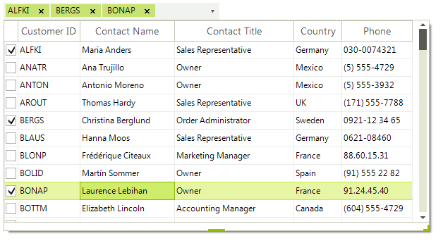

# Multiple Selection 

By default, **RadMultiColumnComboBox** allows single selection. Considering the [DisplayMember]() property, the respective value from the assigned **DataSource** collection is displayed in the editable part when a certain row from the pop up grid is selected.

However, in some cases, it may be required to allow multiple selection, e.g. select business days during the week. The following tutorial demonstartes a sample approach how to achieve multiple selection in **RadMultiColumnComboBox**:

>caption Figure 1: Multiple selection in RadMultiColumnComboBox 



1\. Drag a **RadMultiColumnComboBox** control on the form and populate it with data by setting the [DataSource]() property and specifying the **DisplayMember** and **ValueMember** properties. Create a **RadMultiColumnComboBoxSelectionExtender** class that inherits **System.ComponentModel.Component**. It will contain the whole logic for creating check boxes in the row header column of the pop up grid and creating tokens for the checked rows as well. You can find below a sample implementation:

#### RadMultiColumnComboBox's extender for multiple selection 

{{source=..\SamplesCS\MultiColumnComboBox\MultipleSelectionMCCB.cs region=Extender}} 
{{source=..\SamplesVB\MultiColumnComboBox\MultipleSelectionMCCB.vb region=Extender}} 

````C#
[ToolboxItem(false)]
public class RadMultiColumnComboBoxSelectionExtender : System.ComponentModel.Component
{
    private RadAutoCompleteBoxElement autoCompleteBoxElement;
    private System.Collections.Generic.Dictionary<string, GridViewRowInfo> rows = new System.Collections.Generic.Dictionary<string, GridViewRowInfo>();
    private RadMultiColumnComboBox associatedRadMultiColumnComboBox;
    private Size originalSize = Size.Empty;
    public RadAutoCompleteBoxElement AutoCompleteBoxElement
    {
        get
        {
            return this.autoCompleteBoxElement;
        }
    }
    /// <summary>
    /// Gets the tokenized items.
    /// </summary>
    public RadTokenizedTextItemCollection Items
    {
        get { return this.autoCompleteBoxElement.Items; }
    }
    public RadMultiColumnComboBox AssociatedRadMultiColumnComboBox
    {
        get
        {
            return this.associatedRadMultiColumnComboBox;
        }
        set
        {
            this.SetAssociatedRadMultiColumnComboBox(value);
        }
    }
    private void SetAssociatedRadMultiColumnComboBox(RadMultiColumnComboBox radMultiColumnComboBox)
    {
        if (radMultiColumnComboBox == null && this.associatedRadMultiColumnComboBox != null)
        {
            this.SetAssociatedRadMultiColumnComboBoxCoreToNull();
        }
        this.SetAssociatedRadMultiColumnComboBoxCore(radMultiColumnComboBox);
    }
    private void SetAssociatedRadMultiColumnComboBoxCoreToNull()
    {
        this.associatedRadMultiColumnComboBox.HandleCreated -= associatedRadMultiColumnComboBox_HandleCreated;
        this.associatedRadMultiColumnComboBox.DataBindingComplete -= associatedRadMultiColumnComboBox_DataBindingComplete;
        this.associatedRadMultiColumnComboBox.EditorControl.ViewCellFormatting -= EditorControl_ViewCellFormatting;
        this.associatedRadMultiColumnComboBox.DropDownClosing -= radMultiColumnCombobox1_DropDownClosing;
        this.associatedRadMultiColumnComboBox.MultiColumnComboBoxElement.TextBoxElement.Visibility = ElementVisibility.Visible;
        this.associatedRadMultiColumnComboBox.MultiColumnComboBoxElement.Children[2].Children.Remove(autoCompleteBoxElement);
        this.autoCompleteBoxElement.MaxSize = new Size(0, 0);
        this.autoCompleteBoxElement.AutoCompleteDataSource = null;
        this.associatedRadMultiColumnComboBox.AutoSize = false;
        this.associatedRadMultiColumnComboBox.Size = this.originalSize;
        foreach (GridViewRowInfo item in this.associatedRadMultiColumnComboBox.EditorControl.Rows)
        {
            item.Tag = null;
        }
        this.autoCompleteBoxElement.Items.CollectionChanged -= Items_CollectionChanged;
        this.autoCompleteBoxElement.CreateTextBlock -= autoCompleteBoxElement_CreateTextBlock;
        this.autoCompleteBoxElement.TokenValidating -= autoCompleteBoxElement_TokenValidating;
        this.autoCompleteBoxElement.Text = this.associatedRadMultiColumnComboBox.Text;
        this.autoCompleteBoxElement.KeyDown -= autoCompleteBoxElement_KeyDown;
        this.associatedRadMultiColumnComboBox = null;
        this.rows.Clear();
    }
    private void SetAssociatedRadMultiColumnComboBoxCore(RadMultiColumnComboBox radMultiColumnComboBox)
    {
        if (radMultiColumnComboBox == null)
        {
            return;
        }
        this.originalSize = radMultiColumnComboBox.Size;
        this.associatedRadMultiColumnComboBox = radMultiColumnComboBox;
        this.associatedRadMultiColumnComboBox.AutoSize = true;
        this.associatedRadMultiColumnComboBox.ThemeNameChanged += associatedRadMultiColumnComboBox_ThemeNameChanged;
        this.associatedRadMultiColumnComboBox.HandleCreated += associatedRadMultiColumnComboBox_HandleCreated;
        this.associatedRadMultiColumnComboBox.DataBindingComplete += associatedRadMultiColumnComboBox_DataBindingComplete;
        this.associatedRadMultiColumnComboBox.DropDownStyle = RadDropDownStyle.DropDownList;
        this.associatedRadMultiColumnComboBox.EditorControl.ViewCellFormatting += EditorControl_ViewCellFormatting;
        this.associatedRadMultiColumnComboBox.DropDownClosing += radMultiColumnCombobox1_DropDownClosing;
        this.autoCompleteBoxElement = new RadAutoCompleteBoxElement();
        this.autoCompleteBoxElement.MinSize = new Size(150, 24);
        this.autoCompleteBoxElement.Multiline = true;
        this.autoCompleteBoxElement.DrawBorder = false;
        this.autoCompleteBoxElement.KeyDown += autoCompleteBoxElement_KeyDown;
        this.associatedRadMultiColumnComboBox.MultiColumnComboBoxElement.ArrowButton.ZIndex = 1;
        this.associatedRadMultiColumnComboBox.MultiColumnComboBoxElement.TextBoxElement.Visibility = ElementVisibility.Hidden;
        this.associatedRadMultiColumnComboBox.MultiColumnComboBoxElement.Children[2].Children.Add(this.autoCompleteBoxElement);
        this.autoCompleteBoxElement.MaxSize = new Size(this.associatedRadMultiColumnComboBox.Size.Width - this.associatedRadMultiColumnComboBox.MultiColumnComboBoxElement.ArrowButton.Size.Width, 0);
        this.autoCompleteBoxElement.AutoCompleteDataSource = new System.Collections.Generic.List<string>(GetAutoCompleteItems());
        this.autoCompleteBoxElement.Margin = new System.Windows.Forms.Padding(0);
        this.autoCompleteBoxElement.Items.CollectionChanged += Items_CollectionChanged;
        this.autoCompleteBoxElement.CreateTextBlock += autoCompleteBoxElement_CreateTextBlock;
        this.autoCompleteBoxElement.TokenValidating += autoCompleteBoxElement_TokenValidating;
    }
    void associatedRadMultiColumnComboBox_ThemeNameChanged(object source, ThemeNameChangedEventArgs args)
    {
        this.autoCompleteBoxElement.MaxSize = new Size(this.associatedRadMultiColumnComboBox.Size.Width - this.associatedRadMultiColumnComboBox.MultiColumnComboBoxElement.ArrowButton.Size.Width, 0);
    }
     
    void autoCompleteBoxElement_KeyDown(object sender, System.Windows.Forms.KeyEventArgs e)
    {
        if (e.KeyCode == System.Windows.Forms.Keys.F4)
        {
            associatedRadMultiColumnComboBox.MultiColumnComboBoxElement.ShowPopup();
        }
        if (e.KeyCode == System.Windows.Forms.Keys.Escape)
        {
            associatedRadMultiColumnComboBox.MultiColumnComboBoxElement.ClosePopup(RadPopupCloseReason.CloseCalled);
        }
    }
    void associatedRadMultiColumnComboBox_DataBindingComplete(object sender, GridViewBindingCompleteEventArgs e)
    {
        autoCompleteBoxElement.AutoCompleteDataSource = new System.Collections.Generic.List<string>(GetAutoCompleteItems());
    }
    void associatedRadMultiColumnComboBox_HandleCreated(object sender, EventArgs e)
    {
        autoCompleteBoxElement.AutoCompleteDataSource = new System.Collections.Generic.List<string>(GetAutoCompleteItems());
    }
    private System.Collections.Generic.IEnumerable<string> GetAutoCompleteItems()
    {
        foreach (GridViewRowInfo row in this.associatedRadMultiColumnComboBox.EditorControl.Rows)
        {
            string value = row.Cells[this.associatedRadMultiColumnComboBox.DisplayMember].Value.ToString().Trim();
            if (!rows.ContainsKey(value))
            {
                this.rows.Add(value, row);
            }
            yield return (value);
        }
    }
    void radMultiColumnCombobox1_DropDownClosing(object sender, RadPopupClosingEventArgs args)
    {
        args.Cancel = (args.CloseReason == RadPopupCloseReason.Mouse &&
                     this.associatedRadMultiColumnComboBox.EditorControl.ElementTree.GetElementAtPoint<RadCheckBoxElement>(this.associatedRadMultiColumnComboBox.EditorControl.PointToClient(System.Windows.Forms.Cursor.Position)) != null);
        this.SyncCollection();
    }
    void EditorControl_ViewCellFormatting(object sender, Telerik.WinControls.UI.CellFormattingEventArgs e)
    {
        if (e.ColumnIndex != -1 || e.CellElement.RowIndex == -1)
        {
            return;
        }
        if (e.CellElement.Children.Count == 1)
        {
            RadCheckBoxElement checkBoxElement = new RadCheckBoxElement();
            checkBoxElement.Padding = new System.Windows.Forms.Padding(0, 3, 1, 0);
            checkBoxElement.Alignment = ContentAlignment.MiddleCenter;
            checkBoxElement.NotifyParentOnMouseInput = false;
            e.CellElement.Children.Add(checkBoxElement);
        }
        RadCheckBoxElement checkBox = e.CellElement.FindDescendant<RadCheckBoxElement>();
        checkBox.CheckStateChanged -= checkBox_CheckStateChanged;
        checkBox.IsChecked = e.Row.Tag != null && e.Row.Tag.ToString() == Boolean.TrueString;
        checkBox.CheckStateChanged += checkBox_CheckStateChanged;
    }
    void SyncCollection()
    {
        this.associatedRadMultiColumnComboBox.MultiColumnComboBoxElement.TextBoxElement.SuspendPropertyNotifications();
        this.associatedRadMultiColumnComboBox.Text = string.Empty;
        foreach (GridViewRowInfo item in this.associatedRadMultiColumnComboBox.EditorControl.Rows)
        {
            if (item.Tag != null && item.Tag.ToString() == Boolean.TrueString)
            {
                this.associatedRadMultiColumnComboBox.Text += item.Cells[this.associatedRadMultiColumnComboBox.DisplayMember].Value + "; ";
            }
        }
        this.associatedRadMultiColumnComboBox.MultiColumnComboBoxElement.TextBoxElement.ResumePropertyNotifications();
        autoCompleteBoxElement.Items.CollectionChanged -= Items_CollectionChanged;
        autoCompleteBoxElement.CreateTextBlock -= autoCompleteBoxElement_CreateTextBlock;
        autoCompleteBoxElement.TokenValidating -= autoCompleteBoxElement_TokenValidating;
        autoCompleteBoxElement.Text = this.associatedRadMultiColumnComboBox.Text;
        autoCompleteBoxElement.TokenValidating += autoCompleteBoxElement_TokenValidating;
        autoCompleteBoxElement.CreateTextBlock += autoCompleteBoxElement_CreateTextBlock;
        autoCompleteBoxElement.Items.CollectionChanged += Items_CollectionChanged;
    }
    void autoCompleteBoxElement_TokenValidating(object sender, TokenValidatingEventArgs e)
    {
        if (this.rows.ContainsKey(e.Text))
        {
            if (this.rows[e.Text].Tag + "" == Boolean.TrueString)
            {
                e.IsValidToken = false;
            }
        }
        else
        {
            e.IsValidToken = false;
        }
    }
    void autoCompleteBoxElement_CreateTextBlock(object sender, CreateTextBlockEventArgs e)
    {
        if (this.rows.ContainsKey(e.Text) && e.TextBlock is TokenizedTextBlockElement)
        {
            this.rows[e.Text].Tag = Boolean.TrueString;
            this.rows[e.Text].InvalidateRow();
        }
    }
    void Items_CollectionChanged(object sender, Telerik.WinControls.Data.NotifyCollectionChangedEventArgs e)
    {
        if (e.Action == Telerik.WinControls.Data.NotifyCollectionChangedAction.Remove)
        {
            foreach (RadTokenizedTextItem item in e.NewItems)
            {
                if (this.rows.ContainsKey(item.Text.Trim()))
                {
                    string itemText = item.Text.Trim();
                    this.rows[itemText].Tag = Boolean.FalseString;
                    this.rows[itemText].InvalidateRow();
                }
            }
        }
    }
    void checkBox_CheckStateChanged(object sender, EventArgs e)
    {
        RadCheckBoxElement checkBox = sender as RadCheckBoxElement;
        GridRowElement row = checkBox.FindAncestor<GridRowElement>();
        row.RowInfo.Tag = checkBox.IsChecked.ToString();
    }
}

````
````VB.NET
<ComponentModel.ToolboxItem(False)> _
Public Class RadMultiColumnComboBoxSelectionExtender
    Inherits System.ComponentModel.Component
    Private m_autoCompleteBoxElement As RadAutoCompleteBoxElement
    Private rows As New System.Collections.Generic.Dictionary(Of String, GridViewRowInfo)()
    Private m_associatedRadMultiColumnComboBox As RadMultiColumnComboBox
    Private originalSize As System.Drawing.Size = System.Drawing.Size.Empty
    Public ReadOnly Property AutoCompleteBoxElement() As RadAutoCompleteBoxElement
        Get
            Return Me.m_autoCompleteBoxElement
        End Get
    End Property
    ''' <summary>
    ''' Gets the tokenized items.
    ''' </summary>
    Public ReadOnly Property Items() As RadTokenizedTextItemCollection
        Get
            Return Me.m_autoCompleteBoxElement.Items
        End Get
    End Property
    Public Property AssociatedRadMultiColumnComboBox() As RadMultiColumnComboBox
        Get
            Return Me.m_associatedRadMultiColumnComboBox
        End Get
        Set(value As RadMultiColumnComboBox)
            Me.SetAssociatedRadMultiColumnComboBox(value)
        End Set
    End Property
    Private Sub SetAssociatedRadMultiColumnComboBox(radMultiColumnComboBox As RadMultiColumnComboBox)
        If radMultiColumnComboBox Is Nothing AndAlso Me.m_associatedRadMultiColumnComboBox IsNot Nothing Then
            Me.SetAssociatedRadMultiColumnComboBoxCoreToNull()
        End If
        Me.SetAssociatedRadMultiColumnComboBoxCore(radMultiColumnComboBox)
    End Sub
    Private Sub SetAssociatedRadMultiColumnComboBoxCoreToNull()
        RemoveHandler Me.m_associatedRadMultiColumnComboBox.HandleCreated, AddressOf associatedRadMultiColumnComboBox_HandleCreated
        RemoveHandler Me.m_associatedRadMultiColumnComboBox.DataBindingComplete, AddressOf associatedRadMultiColumnComboBox_DataBindingComplete
        RemoveHandler Me.m_associatedRadMultiColumnComboBox.EditorControl.ViewCellFormatting, AddressOf EditorControl_ViewCellFormatting
        RemoveHandler Me.m_associatedRadMultiColumnComboBox.DropDownClosing, AddressOf radMultiColumnCombobox1_DropDownClosing
        Me.m_associatedRadMultiColumnComboBox.MultiColumnComboBoxElement.TextBoxElement.Visibility = ElementVisibility.Visible
        Me.m_associatedRadMultiColumnComboBox.MultiColumnComboBoxElement.Children(2).Children.Remove(m_autoCompleteBoxElement)
        Me.m_autoCompleteBoxElement.MaxSize = New System.Drawing.Size(0, 0)
        Me.m_autoCompleteBoxElement.AutoCompleteDataSource = Nothing
        Me.m_associatedRadMultiColumnComboBox.AutoSize = False
        Me.m_associatedRadMultiColumnComboBox.Size = Me.originalSize
        For Each item As GridViewRowInfo In Me.m_associatedRadMultiColumnComboBox.EditorControl.Rows
            item.Tag = Nothing
        Next
        RemoveHandler Me.m_autoCompleteBoxElement.Items.CollectionChanged, AddressOf Items_CollectionChanged
        RemoveHandler Me.m_autoCompleteBoxElement.CreateTextBlock, AddressOf autoCompleteBoxElement_CreateTextBlock
        RemoveHandler Me.m_autoCompleteBoxElement.TokenValidating, AddressOf autoCompleteBoxElement_TokenValidating
        Me.m_autoCompleteBoxElement.Text = Me.m_associatedRadMultiColumnComboBox.Text
        RemoveHandler Me.m_autoCompleteBoxElement.KeyDown, AddressOf autoCompleteBoxElement_KeyDown
        Me.m_associatedRadMultiColumnComboBox = Nothing
        Me.rows.Clear()
    End Sub
    Private Sub SetAssociatedRadMultiColumnComboBoxCore(radMultiColumnComboBox As RadMultiColumnComboBox)
        If radMultiColumnComboBox Is Nothing Then
            Return
        End If
        Me.originalSize = radMultiColumnComboBox.Size
        Me.m_associatedRadMultiColumnComboBox = radMultiColumnComboBox
        Me.m_associatedRadMultiColumnComboBox.AutoSize = True
        AddHandler Me.m_associatedRadMultiColumnComboBox.ThemeNameChanged, AddressOf associatedRadMultiColumnComboBox_ThemeNameChanged
        AddHandler Me.m_associatedRadMultiColumnComboBox.HandleCreated, AddressOf associatedRadMultiColumnComboBox_HandleCreated
        AddHandler Me.m_associatedRadMultiColumnComboBox.DataBindingComplete, AddressOf associatedRadMultiColumnComboBox_DataBindingComplete
        Me.m_associatedRadMultiColumnComboBox.DropDownStyle = RadDropDownStyle.DropDownList
        AddHandler Me.m_associatedRadMultiColumnComboBox.EditorControl.ViewCellFormatting, AddressOf EditorControl_ViewCellFormatting
        AddHandler Me.m_associatedRadMultiColumnComboBox.DropDownClosing, AddressOf radMultiColumnCombobox1_DropDownClosing
        Me.m_autoCompleteBoxElement = New RadAutoCompleteBoxElement()
        Me.m_autoCompleteBoxElement.MinSize = New System.Drawing.Size(150, 24)
        Me.m_autoCompleteBoxElement.Multiline = True
        Me.m_autoCompleteBoxElement.DrawBorder = False
        AddHandler Me.m_autoCompleteBoxElement.KeyDown, AddressOf autoCompleteBoxElement_KeyDown
        Me.m_associatedRadMultiColumnComboBox.MultiColumnComboBoxElement.ArrowButton.ZIndex = 1
        Me.m_associatedRadMultiColumnComboBox.MultiColumnComboBoxElement.TextBoxElement.Visibility = ElementVisibility.Hidden
        Me.m_associatedRadMultiColumnComboBox.MultiColumnComboBoxElement.Children(2).Children.Add(Me.m_autoCompleteBoxElement)
        Me.m_autoCompleteBoxElement.MaxSize = New System.Drawing.Size(Me.m_associatedRadMultiColumnComboBox.Size.Width - Me.m_associatedRadMultiColumnComboBox.MultiColumnComboBoxElement.ArrowButton.Size.Width, 0)
        Me.m_autoCompleteBoxElement.AutoCompleteDataSource = New System.Collections.Generic.List(Of String)(GetAutoCompleteItems())
        Me.m_autoCompleteBoxElement.Margin = New System.Windows.Forms.Padding(0)
        AddHandler Me.m_autoCompleteBoxElement.Items.CollectionChanged, AddressOf Items_CollectionChanged
        AddHandler Me.m_autoCompleteBoxElement.CreateTextBlock, AddressOf autoCompleteBoxElement_CreateTextBlock
        AddHandler Me.m_autoCompleteBoxElement.TokenValidating, AddressOf autoCompleteBoxElement_TokenValidating
    End Sub
    Private Sub associatedRadMultiColumnComboBox_ThemeNameChanged(source As Object, args As ThemeNameChangedEventArgs)
        Me.m_autoCompleteBoxElement.MaxSize = New System.Drawing.Size(Me.m_associatedRadMultiColumnComboBox.Size.Width - Me.m_associatedRadMultiColumnComboBox.MultiColumnComboBoxElement.ArrowButton.Size.Width, 0)
    End Sub
    Private Sub autoCompleteBoxElement_KeyDown(sender As Object, e As System.Windows.Forms.KeyEventArgs)
        If e.KeyCode = System.Windows.Forms.Keys.F4 Then
            m_associatedRadMultiColumnComboBox.MultiColumnComboBoxElement.ShowPopup()
        End If
        If e.KeyCode = System.Windows.Forms.Keys.Escape Then
            m_associatedRadMultiColumnComboBox.MultiColumnComboBoxElement.ClosePopup(RadPopupCloseReason.CloseCalled)
        End If
    End Sub
    Private Sub associatedRadMultiColumnComboBox_DataBindingComplete(sender As Object, e As GridViewBindingCompleteEventArgs)
        m_autoCompleteBoxElement.AutoCompleteDataSource = New System.Collections.Generic.List(Of String)(GetAutoCompleteItems())
    End Sub
    Private Sub associatedRadMultiColumnComboBox_HandleCreated(sender As Object, e As EventArgs)
        m_autoCompleteBoxElement.AutoCompleteDataSource = New System.Collections.Generic.List(Of String)(GetAutoCompleteItems())
    End Sub
    Private Function GetAutoCompleteItems() As System.Collections.Generic.IEnumerable(Of String)
        Dim items As New List(Of String)
        For Each row As GridViewRowInfo In Me.m_associatedRadMultiColumnComboBox.EditorControl.Rows
            Dim value As String = row.Cells(Me.m_associatedRadMultiColumnComboBox.DisplayMember).Value.ToString().Trim()
            If Not rows.ContainsKey(value) Then
                Me.rows.Add(value, row)
            End If
            items.Add(value)
        Next
        Return items
    End Function
    Private Sub radMultiColumnCombobox1_DropDownClosing(sender As Object, args As RadPopupClosingEventArgs)
        args.Cancel = (args.CloseReason = RadPopupCloseReason.Mouse AndAlso Me.m_associatedRadMultiColumnComboBox.EditorControl.ElementTree.GetElementAtPoint(Of RadCheckBoxElement)(Me.m_associatedRadMultiColumnComboBox.EditorControl.PointToClient(System.Windows.Forms.Cursor.Position)) IsNot Nothing)
        Me.SyncCollection()
    End Sub
    Private Sub EditorControl_ViewCellFormatting(sender As Object, e As Telerik.WinControls.UI.CellFormattingEventArgs)
        If e.ColumnIndex <> -1 OrElse e.CellElement.RowIndex = -1 Then
            Return
        End If
        If e.CellElement.Children.Count = 1 Then
            Dim checkBoxElement As New RadCheckBoxElement()
            checkBoxElement.Padding = New System.Windows.Forms.Padding(0, 3, 1, 0)
            checkBoxElement.Alignment = ContentAlignment.MiddleCenter
            checkBoxElement.NotifyParentOnMouseInput = False
            e.CellElement.Children.Add(checkBoxElement)
        End If
        Dim checkBox As RadCheckBoxElement = e.CellElement.FindDescendant(Of RadCheckBoxElement)()
        RemoveHandler checkBox.CheckStateChanged, AddressOf checkBox_CheckStateChanged
        checkBox.IsChecked = e.Row.Tag IsNot Nothing AndAlso e.Row.Tag.ToString() = [Boolean].TrueString
        AddHandler checkBox.CheckStateChanged, AddressOf checkBox_CheckStateChanged
    End Sub
    Private Sub SyncCollection()
        Me.m_associatedRadMultiColumnComboBox.MultiColumnComboBoxElement.TextBoxElement.SuspendPropertyNotifications()
        Me.m_associatedRadMultiColumnComboBox.Text = String.Empty
        For Each item As GridViewRowInfo In Me.m_associatedRadMultiColumnComboBox.EditorControl.Rows
            If item.Tag IsNot Nothing AndAlso item.Tag.ToString() = [Boolean].TrueString Then
                Me.m_associatedRadMultiColumnComboBox.Text += item.Cells(Me.m_associatedRadMultiColumnComboBox.DisplayMember).Value + "; "
            End If
        Next
        Me.m_associatedRadMultiColumnComboBox.MultiColumnComboBoxElement.TextBoxElement.ResumePropertyNotifications()
        RemoveHandler m_autoCompleteBoxElement.Items.CollectionChanged, AddressOf Items_CollectionChanged
        RemoveHandler m_autoCompleteBoxElement.CreateTextBlock, AddressOf autoCompleteBoxElement_CreateTextBlock
        RemoveHandler m_autoCompleteBoxElement.TokenValidating, AddressOf autoCompleteBoxElement_TokenValidating
        m_autoCompleteBoxElement.Text = Me.m_associatedRadMultiColumnComboBox.Text
        AddHandler m_autoCompleteBoxElement.TokenValidating, AddressOf autoCompleteBoxElement_TokenValidating
        AddHandler m_autoCompleteBoxElement.CreateTextBlock, AddressOf autoCompleteBoxElement_CreateTextBlock
        AddHandler m_autoCompleteBoxElement.Items.CollectionChanged, AddressOf Items_CollectionChanged
    End Sub
    Private Sub autoCompleteBoxElement_TokenValidating(sender As Object, e As TokenValidatingEventArgs)
        If Me.rows.ContainsKey(e.Text) Then
            If Me.rows(e.Text).Tag + "" = [Boolean].TrueString Then
                e.IsValidToken = False
            End If
        Else
            e.IsValidToken = False
        End If
    End Sub
    Private Sub autoCompleteBoxElement_CreateTextBlock(sender As Object, e As CreateTextBlockEventArgs)
        If Me.rows.ContainsKey(e.Text) AndAlso TypeOf e.TextBlock Is TokenizedTextBlockElement Then
            Me.rows(e.Text).Tag = [Boolean].TrueString
            Me.rows(e.Text).InvalidateRow()
        End If
    End Sub
    Private Sub Items_CollectionChanged(sender As Object, e As Telerik.WinControls.Data.NotifyCollectionChangedEventArgs)
        If e.Action = Telerik.WinControls.Data.NotifyCollectionChangedAction.Remove Then
            For Each item As RadTokenizedTextItem In e.NewItems
                If Me.rows.ContainsKey(item.Text.Trim()) Then
                    Dim itemText As String = item.Text.Trim()
                    Me.rows(itemText).Tag = [Boolean].FalseString
                    Me.rows(itemText).InvalidateRow()
                End If
            Next
        End If
    End Sub
    Private Sub checkBox_CheckStateChanged(sender As Object, e As EventArgs)
        Dim checkBox As RadCheckBoxElement = TryCast(sender, RadCheckBoxElement)
        Dim row As GridRowElement = checkBox.FindAncestor(Of GridRowElement)()
        row.RowInfo.Tag = checkBox.IsChecked.ToString()
    End Sub
End Class

````

{{endregion}} 

2\. Create an instance of the above implemented extender and set its **AssociatedRadMultiColumnComboBox** property to the available **RadMultiColumnComboBox** after it is populated with data:

{{source=..\SamplesCS\MultiColumnComboBox\MultipleSelectionMCCB.cs region=ApplyMultiSelection}} 
{{source=..\SamplesVB\MultiColumnComboBox\MultipleSelectionMCCB.vb region=ApplyMultiSelection}} 

````C#
RadMultiColumnComboBoxSelectionExtender extender = new RadMultiColumnComboBoxSelectionExtender();
extender.AssociatedRadMultiColumnComboBox = this.radMultiColumnComboBox1;

````
````VB.NET
Dim extender As New RadMultiColumnComboBoxSelectionExtender()
extender.AssociatedRadMultiColumnComboBox = Me.RadMultiColumnComboBox1

````

{{endregion}} 

>note A fully functional example is available in our *Demo aplication >> MultiColumnComboBox* section.

# See Also

* [Structure]()	
* [Getting Started]()	

