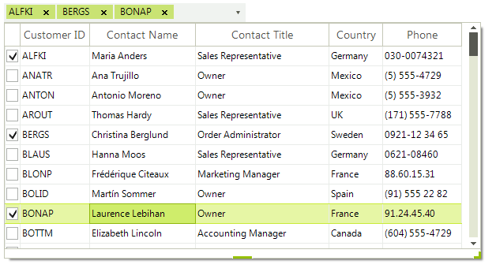

# Multiple Selection 

By default, **RadMultiColumnComboBox** allows single selection. Considering the [DisplayMember]() property, the respective value from the assigned **DataSource** collection is displayed in the editable part when a certain row from the pop up grid is selected.

However, in some cases, it may be required to allow multiple selection, e.g. select business days during the week. The following tutorial demonstartes a sample approach how to achieve multiple selection in **RadMultiColumnComboBox**:

>caption Figure 1: Multiple Selection in RadMultiColumnComboBox 

1\. Drag a **RadMultiColumnComboBox** control on the form and populate it with data by setting the [DataSource]() property and specifying the **DisplayMember** and **ValueMember** properties. Create a **RadMultiColumnComboBoxSelectionExtender** class that inherits **System.ComponentModel.Component**. It will contain the whole logic for creating check boxes in the row header column of the pop up grid and creating tokens for the checked rows as well. You can find below a sample implementation:

#### RadMultiColumnComboBox's extender for multiple selection 

<snippet id='multicolumncombobox-multipleselectionmccb-extender-cs' />
<snippet id='multicolumncombobox-multipleselectionmccb-extender-vb' />

2\. Create an instance of the above implemented extender and set its **AssociatedRadMultiColumnComboBox** property to the available **RadMultiColumnComboBox** after it is populated with data:

<snippet id='multicolumncombobox-multipleselectionmccb-applymultiselection-cs' />
<snippet id='multicolumncombobox-multipleselectionmccb-applymultiselection-vb' />

>note A fully functional example is available in our *Demo aplication >> MultiColumnComboBox* section.

>note Another approach is demonstrated in the [How to Achieve Checked RadMultiColumnComboBox]() KB article.

# See Also

* [Structure]()	
* [Getting Started]()	
* [How to Achieve Checked RadMultiColumnComboBox]()

