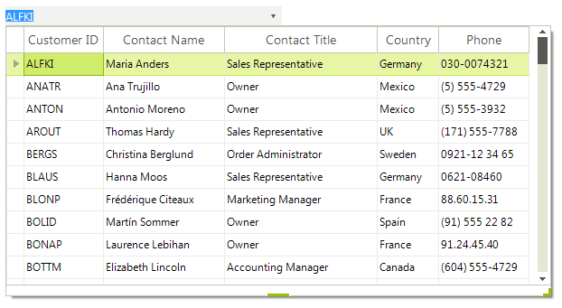

# WinForms MultiColumnComboBox Overview

**RadMultiColumnComboBox** is a special case of combo box control with **RadGridView** integrated in its drop-down. The control combines the functionality and features of [RadDropDownList]() and [RadGridView](). 





## Key Featues

* Easily customizable appearance and theming mechanism.
* Binding to a wide set of binding sources
* Filtering
* Selection and navigation
* Flexible API

The current version has some limitations that you should consider: 

* The **RadGridView** hosted in the drop-down does not allow editing operations.

* The **RadGridView** hosted in the drop-down does not support filtering, grouping and sorting operations.

## Telerik UI for WinForms Learning Resources
* [Telerik UI for WinForms MultiColumnComboBox Homepage](https://www.telerik.com/products/winforms/multicolumncombo.aspx)
* [Get Started with the Telerik UI for WinForms MultiColumnComboBox]()
* [Telerik UI for WinForms API Reference](https://docs.telerik.com/devtools/winforms/api/)
* [Getting Started with Telerik UI for WinForms Components]()
* [Telerik UI for WinForms Virtual Classroom (Training Courses for Registered Users)](https://learn.telerik.com/learn/course/external/view/elearning/17/TelerikUIforWinForms) 
* [Telerik UI for WinForms Forum](https://www.telerik.com/forums/winforms)
* [Telerik UI for WinForms Knowledge Base](https://docs.telerik.com/devtools/winforms/knowledge-base)

## Telerik UI for WinForms Additional Resources
* [Telerik UI for WinForms Product Overview](https://www.telerik.com/products/winforms.aspx)
* [Telerik UI for WinForms Blog](https://www.telerik.com/blogs/desktop-winforms)
* [Telerik UI for WinForms Videos](https://www.telerik.com/videos/product/winforms)
* [Telerik UI for WinForms Roadmap](https://www.telerik.com/support/whats-new/winforms/roadmap)
* [Telerik UI for WinForms Pricing](https://www.telerik.com/purchase/individual/winforms.aspx)
* [Telerik UI for WinForms Code Library](https://www.telerik.com/support/code-library/winforms)
* [Telerik UI for WinForms Support](https://www.telerik.com/support/winforms)
* [What’s New in Telerik UI for WinForms](https://www.telerik.com/support/whats-new/winforms)

## See Also

* [Structure]()	
* [Getting Started]()	
* [How to Achieve Checked RadMultiColumnComboBox]()

