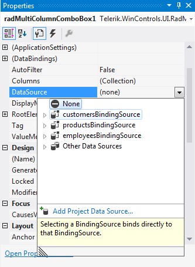
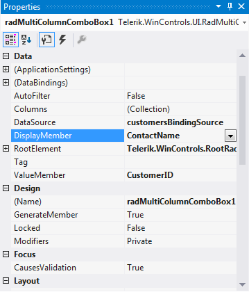
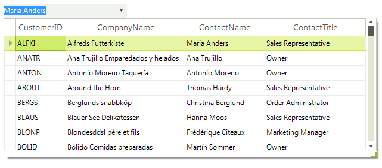
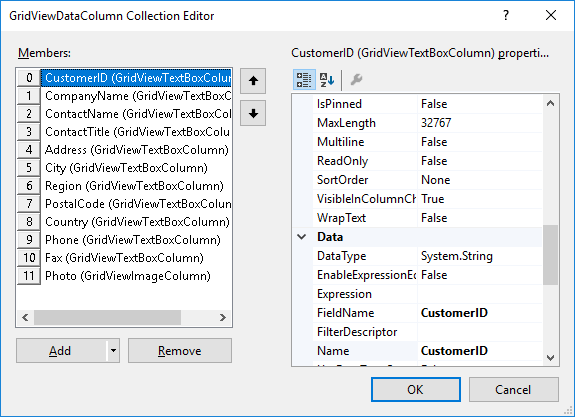
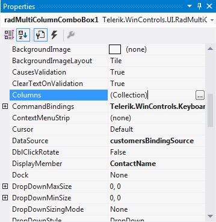

# Data Binding

Data binding is a mechanism for automatic population of the **RadMultiColumnComboBox** with data, based on the provided data structure. Three properties control the data binding:

* __DataSource__ - specifies the data structure to be bound.       

* __DisplayMember__ - specifies the particular field in the data source which will be used from the items in **RadMultiColumnComboBox** for the Text.         

* __ValueMember__ - specifies the particular field in the data source which will be stored in the Value property.
          
**RadMultiColumnComboBox** supports data binding either at design time or at run time:

## Data Binding at design time

You can set the __DataSource__ property at design time in the *Properties* window of Visual Studio.

1\. Select the __DataSource__ property and click the drop-down arrow to display all existing data sources on the form.
 
>caption Figure 1: DataSource



This will force the **RadGridView** (contained in **RadMultiColumnComboBox**) to auto-generate columns for each field in the specified **DataSource**. 

2\. Set the **DisplayMember** and **ValueMember** properties.

>caption Figure 2: DisplayMember and ValueMember



As a result **RadMultiColumnComboBox** is bound to the Northwind.Customers table:

>caption Figure 3: Bound RadMultiColumnComboBox



###  Columns collection

You can set your own columns list using the [Columns]() collection editor of __RadGridView__:

>caption Figure 4: GridViewDataColumn Collection Editor



The collection editor is accessible through the [Columns]() property in the *Properties* grid: 



The important point when adding columns manually is to turn off the automatic generation of columns, otherwise you will have your columns duplicated in run time.

#### Adding columns

{{source=..\SamplesCS\MultiColumnComboBox\MultiColumnComboBox1.cs region=setUp}} 
{{source=..\SamplesVB\MultiColumnComboBox\MultiColumnComboBox1.vb region=setUp}} 

````C#
    
protected override void OnLoad(EventArgs e)
{
    base.OnLoad(e);
    
    NwindDataSet nwindDataSet = new NwindDataSet();
    CustomersTableAdapter customersTableAdapter = new CustomersTableAdapter();
    customersTableAdapter.Fill(nwindDataSet.Customers);
    this.radMultiColumnComboBox1.DataSource = nwindDataSet.Customers;
    foreach (GridViewDataColumn column in
        this.radMultiColumnComboBox1.MultiColumnComboBoxElement.Columns)
    {
        column.BestFit();
    }
}
    
void SetUpGrid()
{
    RadGridView gridViewControl = this.radMultiColumnComboBox1.EditorControl;
    gridViewControl.MasterTemplate.AutoGenerateColumns = false;
    gridViewControl.Columns.Add(new GridViewTextBoxColumn("CustomerID"));
    gridViewControl.Columns.Add(new GridViewTextBoxColumn("ContactName"));
    gridViewControl.Columns.Add(new GridViewTextBoxColumn("ContactTitle"));
    gridViewControl.Columns.Add(new GridViewTextBoxColumn("Country"));
    gridViewControl.Columns.Add(new GridViewTextBoxColumn("Phone"));
}

````
````VB.NET
Protected Overrides Sub OnLoad(ByVal e As EventArgs)
    MyBase.OnLoad(e)
    Dim nwindDataSet As New NwindDataSet()
    Dim customersTableAdapter As New CustomersTableAdapter()
    customersTableAdapter.Fill(nwindDataSet.Customers)
    Me.RadMultiColumnComboBox1.DataSource = nwindDataSet.Customers
    For Each column As GridViewDataColumn In Me.RadMultiColumnComboBox1.MultiColumnComboBoxElement.Columns
        column.BestFit()
    Next column
End Sub
Private Sub SetUpGrid()
    Dim gridViewControl As RadGridView = Me.RadMultiColumnComboBox1.EditorControl
    gridViewControl.MasterTemplate.AutoGenerateColumns = False
    gridViewControl.Columns.Add(New GridViewTextBoxColumn("CustomerID"))
    gridViewControl.Columns.Add(New GridViewTextBoxColumn("ContactName"))
    gridViewControl.Columns.Add(New GridViewTextBoxColumn("ContactTitle"))
    gridViewControl.Columns.Add(New GridViewTextBoxColumn("Country"))
    gridViewControl.Columns.Add(New GridViewTextBoxColumn("Phone"))
End Sub

````

{{endregion}} 

## Data binding at run time

You can bind **RadMultiColumnComboBox** programmatically. It is necessary to set the **DataSource**, **ValueMember** and **DisplayMember** properties of **RadMultiColumnComboBox**.

#### Binding at run time

{{source=..\SamplesCS\MultiColumnComboBox\MCCBgettingStarted.cs region=Binding}} 
{{source=..\SamplesVB\MultiColumnComboBox\MCCBgettingStarted.vb region=Binding}} 

````C#
            
this.radMultiColumnComboBox1.DisplayMember = "LastName";
this.radMultiColumnComboBox1.ValueMember = "EmployeeID";
this.radMultiColumnComboBox1.DataSource = this.employeesBindingSource;

````
````VB.NET
Me.RadMultiColumnComboBox1.DisplayMember = "LastName"
Me.RadMultiColumnComboBox1.ValueMember = "EmployeeID"
Me.RadMultiColumnComboBox1.DataSource = Me.EmployeesBindingSource

````

{{endregion}} 

# See Also

* [Unbound Mode]()	

