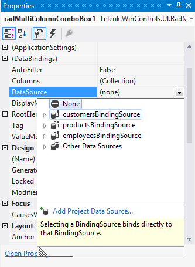
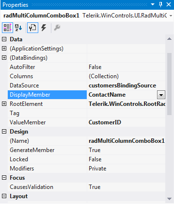
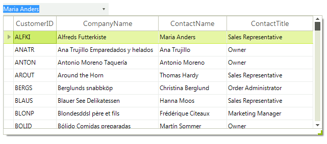
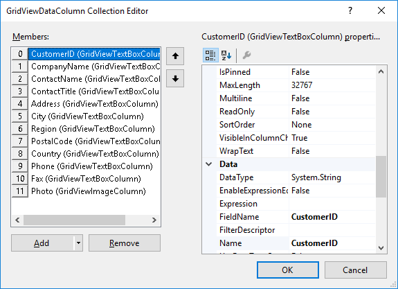
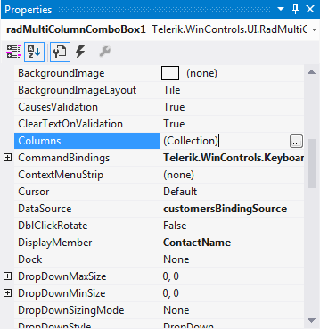

# Data Binding

Data binding is a mechanism for automatic population of the **RadMultiColumnComboBox** with data, based on the provided data structure. Three properties control the data binding:

* __DataSource__ - specifies the data structure to be bound.       

* __DisplayMember__ - specifies the particular field in the data source which will be used from the items in **RadMultiColumnComboBox** for the Text.         

* __ValueMember__ - specifies the particular field in the data source which will be stored in the Value property.
          
**RadMultiColumnComboBox** supports data binding either at design time or at run time:

## Data Binding at design time

You can set the __DataSource__ property at design time in the *Properties* window of Visual Studio.

1\. Select the __DataSource__ property and click the drop-down arrow to display all existing data sources on the form.
 
>caption Figure 1: DataSource

This will force the **RadGridView** (contained in **RadMultiColumnComboBox**) to auto-generate columns for each field in the specified **DataSource**. 

2\. Set the **DisplayMember** and **ValueMember** properties.

>caption Figure 2: DisplayMember and ValueMember

As a result **RadMultiColumnComboBox** is bound to the Northwind.Customers table:

>caption Figure 3: Bound RadMultiColumnComboBox

###  Columns collection

You can set your own columns list using the [Columns](https://docs.telerik.com/devtools/winforms/controls/gridview/columns/gridviewcolumn) collection editor of __RadGridView__:

>caption Figure 4: GridViewDataColumn Collection Editor

The collection editor is accessible through the [Columns](https://docs.telerik.com/devtools/winforms/controls/gridview/columns/gridviewcolumn) property in the *Properties* grid: 

The important point when adding columns manually is to turn off the automatic generation of columns, otherwise you will have your columns duplicated in run time.

#### Adding columns

<snippet id='multicolumncombobox-multicolumncombobox1-setup-cs' />
<snippet id='multicolumncombobox-multicolumncombobox1-setup-vb' />

## Data binding at run time

You can bind **RadMultiColumnComboBox** programmatically. It is necessary to set the **DataSource**, **ValueMember** and **DisplayMember** properties of **RadMultiColumnComboBox**.

#### Binding at run time

<snippet id='multicolumncombobox-mccbgettingstarted-binding-cs' />
<snippet id='multicolumncombobox-mccbgettingstarted-binding-vb' />

# See Also

* [Unbound Mode]()	

