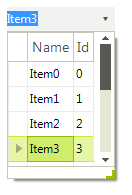

# Unbound Mode

**RadMultiColumnComboBox** supports unbound mode allowing to add columns and rows programmatically.

#### Unbound mode

{{source=..\SamplesCS\MultiColumnComboBox\MCCBgettingStarted.cs region=UnboundMode}} 
{{source=..\SamplesVB\MultiColumnComboBox\MCCBgettingStarted.vb region=UnboundMode}} 

````C#
this.radMultiColumnComboBox1.MultiColumnComboBoxElement.Columns.Add("Name");
this.radMultiColumnComboBox1.MultiColumnComboBoxElement.Columns.Add("Id");
            
for (int i = 0; i < 10; i++)
{
    this.radMultiColumnComboBox1.EditorControl.Rows.Add("Item" + i, i);
}

````
````VB.NET
Me.radMultiColumnComboBox1.MultiColumnComboBoxElement.Columns.Add("Name")
Me.radMultiColumnComboBox1.MultiColumnComboBoxElement.Columns.Add("Id")
For i As Integer = 0 To 9
    Me.RadMultiColumnComboBox1.EditorControl.Rows.Add("Item" & i, i)
Next

````

{{endregion}} 

>caption Figure 1: Unbound mode




# See Also

* [Data Binding]()	