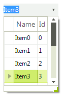

# Unbound Mode

**RadMultiColumnComboBox** supports unbound mode allowing to add columns and rows programmatically.

#### Unbound mode

<snippet id='multicolumncombobox-mccbgettingstarted-unboundmode-cs' />
<snippet id='multicolumncombobox-mccbgettingstarted-unboundmode-vb' />

>caption Figure 1: Unbound mode

# See Also

* [Data Binding]()	
