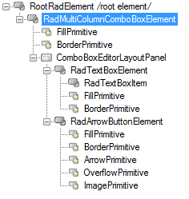
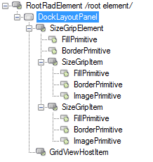
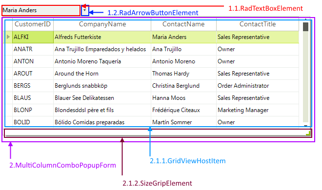

# Structure

This article describes the inner structure and organization of the elements which build the **RadMultiColumnComboBox** control.

>caption Figure 1: RadMultiColumnComboBox's elements hierarchy

>caption Figure 2: MultiColumnComboPopupForm's elements hierarchy

        
>caption Figure 3: RadMultiColumnComboBox visual structure

1\. **RadMultiColumnComboBoxelement**:    
&nbsp;&nbsp;&nbsp;&nbsp;1\. 1\. **RadTextBoxElement**: represents the editor element.   
&nbsp;&nbsp;&nbsp;&nbsp;1\. 2\. **RadArrowButtonElement**: represents the arrow primitive.  
2\. **MultiColumnComboPopupForm**:        
&nbsp;&nbsp;2\.1\. **DockLayoutPanel**:    
&nbsp;&nbsp;&nbsp;&nbsp;2\.1\.1\. **GridViewHostItem**: hosts the pop up **RadGridView**.   
&nbsp;&nbsp;&nbsp;&nbsp;2\.1\.2\. **SizeGripElement**: represents the resizing grip.

The drop-down element is an object of type __MultiColumnComboBoxElement__. Use this element to set the [drop-down style](), [animation]() and [sizing]() as you would do for the regular combo box.  

The __EditorControl__ property of the __RadMultiColumnComboBoxElement__ gives you a reference to the __RadGridView__ control. Using that reference you can obtain the **RadGridView** object and work as with normal **RadGridView** control. Refer to the [RadGridView documentation] () for additional information on **RadGridView**.

# See Also

* [RadControlSpy]()

