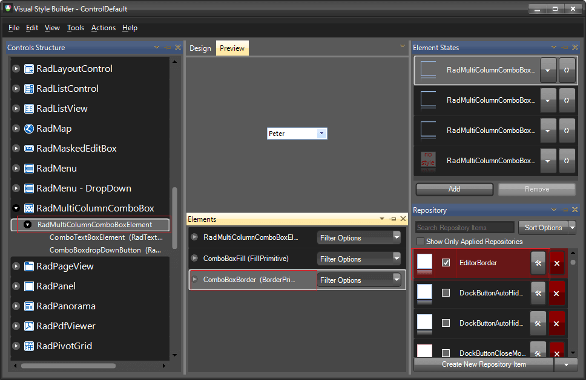
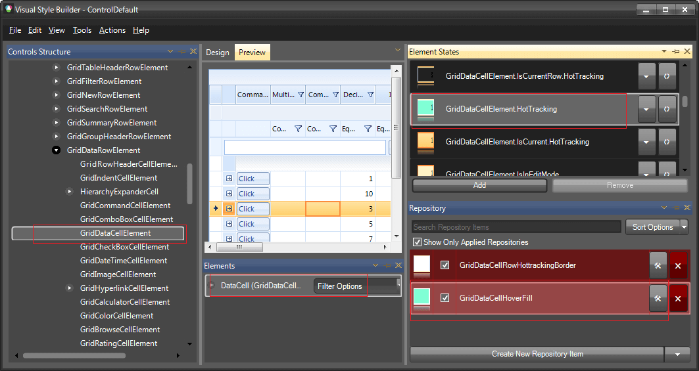
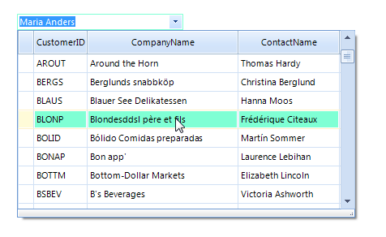

# Themes
 
Since **RadMultiColumnComboBox** is a compound control, it uses the theming of __RadGridView__. Therefore, in order to make a theme for __RadMultiColumnComboBox__, you should change the styles for __RadMultiColumnComboBox__ and for __RadGridView__. The following example will show you how to edit the predefined __ControlDefault__ theme for **RadMultiColumnComboBox**.

1\. Open [VisualStyleBuilder](): Start menu (Start >> Programs >> Telerik >> UI for WinForms [version] >> Tools).

2\. Export the built-in themes in a specific folder by selecting *File >> Export Built-in Themes*.

3\. Load a desired theme from the just exported files by selecting *File >> Open Package*.

4\. First, we can change the appearance of the __RadMultiColumnComboBox__ element. Let's change its BorderPrimitive.__ForeColor__ to *Light Green*. To do that, we can just change the fore color of the already applied repository item style.

5\. Now, we can edit the styles for the __RadGridView__. For this example we will change the hover row back color to a light green. This can be achieved by selecting the __GridDataCellElement__ and changing the __BackColor__ of the __GridDataCellHoverFill__ repository item.

6\. Save the theme by selecting *File >> Save As*.

7\. Now, you can apply your custom theme to **RadMultiColumnComboBox** by using the demonstrated approach in the following link: [Using custom themes]()

# See Also

* [Load Predfined Themes]()
* [Getting Started with VisualStyleBuilder]()
* [Working With Repository Items]()
* [Using Custom Themes]()
