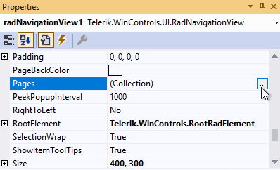
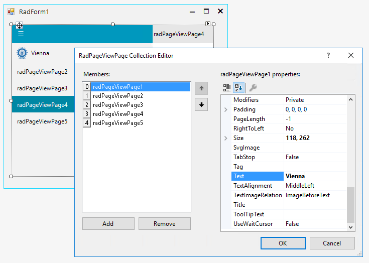
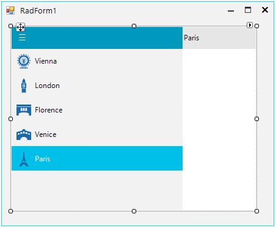

# Getting Started

To start using **RadNavigationView**, just drag it from the toolbox and drop it onto the form.

1\. Select the RadNavigationView control and click the small arrow on the top right position in order to open the Smart Tag. It allows you to add/remove pages and adjust the settings relevant for the [NavigationView]()	 

2\. The *Properties* section in Visual Studio gives access to the *RadPageView Collection Editor*:

It is possible to add/remove pages, change the page's text, image, etc.

3\. Once you are done with the changes, press the OK button to confirm the changes and close the collection editor:

Now, each page has an associated content area (on the right) where the developer can build whatever design is required for the page. Just select the page and drag the necessary controls.  

# See Also

* [Navigation View]()	 

