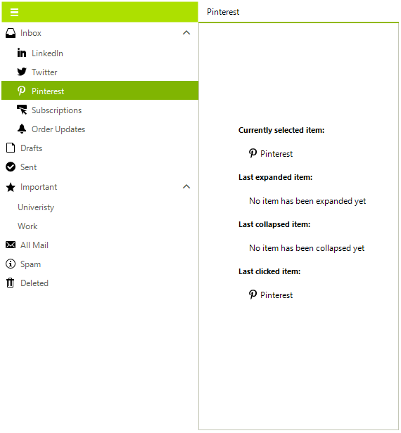
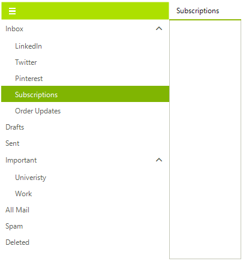
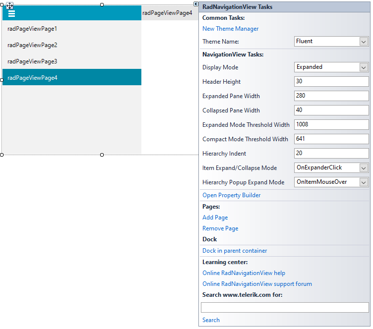
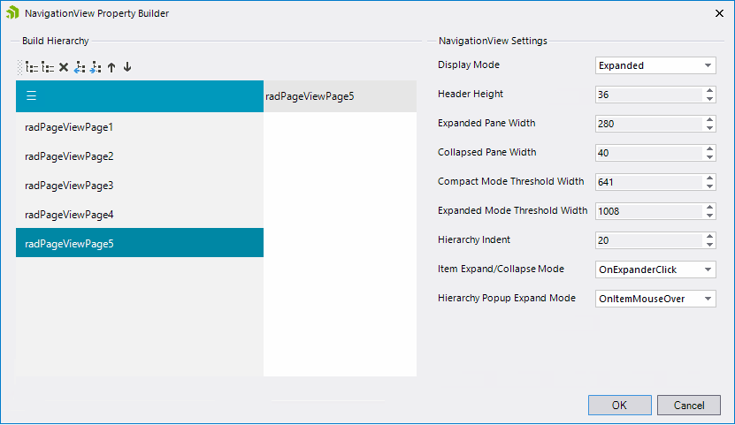

# Hierarchy Support

**RadNavigationView** allows you to define sub-items in order to achieve hierarchical menu visualization.

Each **RadPageViewPage** element has a **SubPages** collection that can be populated with RadPageViewPage items, thus allowing multiple levels of items to be defined in the hierarchy.

>important The **SubPages** collection is considered only when using Navigation view. For the rest of the views, it doesn't take effect.  

### Building Hierarchy with Nested Pages Programmatically

<snippet id='navigationview-navigationview-hierarchy-cs' />
<snippet id='navigationview-navigationview-hierarchy-vb' />

### Setup Hierarchy at Design Time

At design time, the hierarchy can be built by using the Property Builder which can be started from the Smart Tag:

It allows adding new pages or dragging the existing pages to a new location and thus build nested menus:

>caption NavigationView Property Builder

### NavigationView Hierarchy Settings

* **HierarchyIndent**: Gets or sets the hierarchical indentation of the child items. Default value = 20.

* **ExpandedGlyph**: Gets or sets the glyph used for the items's expander element, when the item IsExpanded property is true.

* **CollapsedGlyph**: Gets or sets the glyph used for the items's expander element, when the item IsExpanded property is false.

* **ItemExpandCollapseMode**: Gets or sets the expand/collapse mode of navigation items when they have hierarchical children. The available values are: *OnItemClick* and *OnExpanderClick*. 

* **HierarchyPopupExpandMode**: Gets or sets the expand/collapse mode of navigation items when they have hierarchical children.

