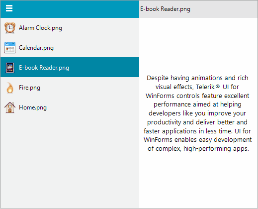

# RadNavigationView

As of **R2 2022 SP1** Telerik UI for WinForms suite offers a standalone **RadNavigationView** control. It provides a collapsible navigation pane that helps implement the hamburger menu pattern and automatically adapts the pane's display mode to different control sizes. The idea of the control is to be a top-level container and to contain all the controls and views that would be typically placed on a form. The menu pane is for navigation between different views and is not meant to contain actions.

>note RadNavigationView actually represents a [RadPageView]() with already applied ViewMode to NavigationView. The whole API that is available for the PageViewMode.NavigationView is also valid for RadNavigationView. 





## Key Features

* Extensibility, scalability and ease of use. With the similar semantic that lies behind RadPageView, it is very easy with RadNavigationView to create custom views over a collection of pages.

* Hierarchy support. [Read more]()

* Different [DisplayModes]() the developer to choose from:
	* __Minimal__
	* __Compact__
	* __Expanded__
	* __Auto__

# See Also

* [Navigation View]()	 
* [Getting Started]()
* [Structure]()

