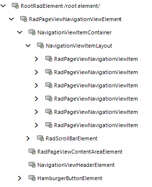
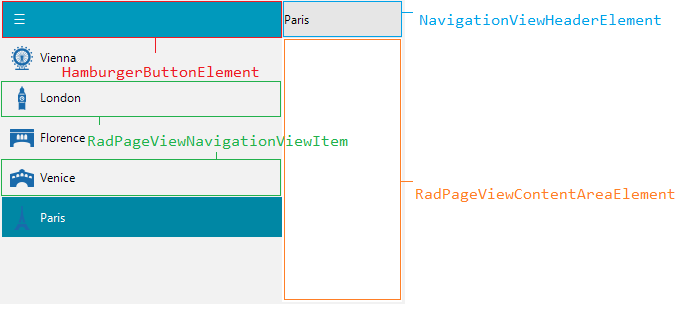

# Structure

This article will show the internal elements structure of RadNavigationView.

>caption Figure 1: RadNavigationView's elements hierarchy

>caption Figure 2: RadNavigationView's structure

**RadPageViewNavigationViewElement** is the main element of RadNavigationView. It contains:

* **NavigationViewHeaderElement** - represents the header element associated with the currently selected page.
* **HamburgerButtonElement** - represents the button that is responsible for expanding/collapsing.
* **NavigationViewItemContainer** - contains the RadPageViewNavigationViewItems.
* **RadPageViewContentAreaElement** - represents the content area associated with the selected page.

# See Also

* [Navigation View]()	 
* [Getting Started]()

