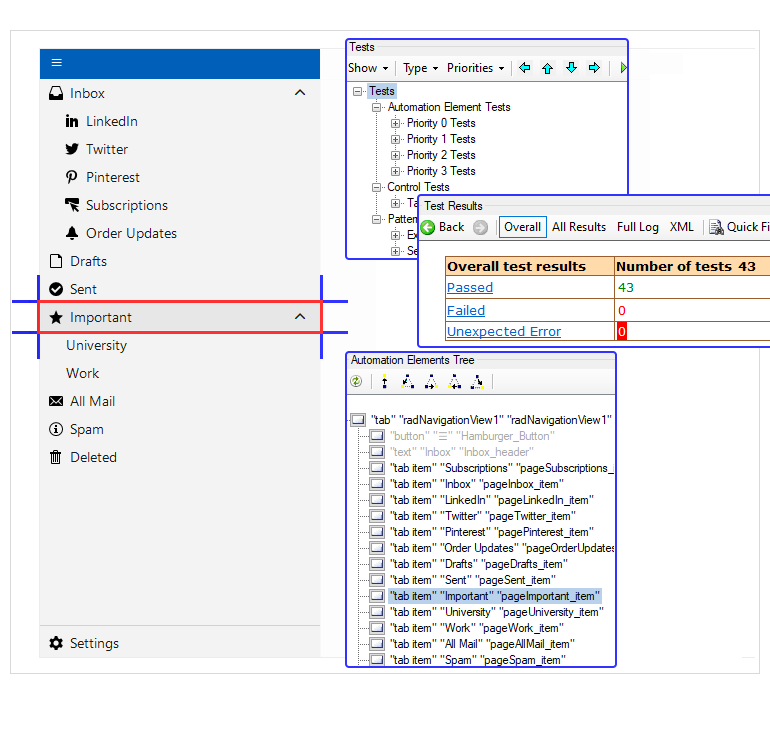

# UI Automation Support

With the Q3 2024 version of our controls, RadNavigationView supports UI Automation. The current implementation of UI Automation for RadNavigationView is similar to the MS WinForms TabControl implementation with some extended functionality. The main goal of this implementation is to ensure compliance with accessibility standards and to provide a common practice for automated testing. 

This functionality is enabled by default. To disable it, you can set the __EnableUIAutomation__ property to false.

{{source=..\SamplesCS\GridView\Cells\NavigationView.cs region=enableUIAutomation}} 
{{source=..\SamplesVB\GridView\Cells\NavigationView.vb region=enableUIAutomation}} 

````C#

this.radNavigationView1.EnableUIAutomation = false;

````
````VB.NET

Me.RadNavigationView1.EnableUIAutomation = False

````

{{endregion}}



## Relevant Properties 

The table below outlines the __UI Automation__ properties most important for understanding and interacting with RadNavigationView control.

#### RadNavigationView 

* AutomationElementIdentifiers.AutomationIdProperty.Id 
* AutomationElementIdentifiers.IsKeyboardFocusableProperty.Id 
* AutomationElementIdentifiers.NameProperty.Id 
* AutomationElementIdentifiers.LabeledByProperty.Id 
* AutomationElementIdentifiers.ControlTypeProperty.Id => ControlType.Tab.Id 
* AutomationElementIdentifiers.LocalizedControlTypeProperty.Id => "tab" 
* AutomationElementIdentifiers.IsContentElementProperty.Id 
* AutomationElementIdentifiers.IsControlElementProperty.Id 
* AutomationElementIdentifiers.OrientationProperty.Id 
* AutomationElementIdentifiers.ClassNameProperty.Id 
* AutomationElementIdentifiers.IsEnabledProperty.Id 
* AutomationElementIdentifiers.HasKeyboardFocusProperty.Id 
* AutomationElementIdentifiers.IsSelectionPatternAvailableProperty.Id 
* AutomationElementIdentifiers.IsExpandCollapsePatternAvailableProperty.Id 

#### Hamburger Button Element
 
* AutomationElementIdentifiers.NameProperty.Id 
* AutomationElementIdentifiers.AutomationIdProperty.Id => "Hamburger_Button" 
* AutomationElementIdentifiers.LocalizedControlTypeProperty.Id => "button" 
* AutomationElementIdentifiers.ControlTypeProperty.Id => ControlType.Button.Id 
* AutomationElementIdentifiers.IsControlElementProperty.Id 
* AutomationElementIdentifiers.IsContentElementProperty.Id 
* AutomationElementIdentifiers.ClassNameProperty.Id 
* AutomationElementIdentifiers.HelpTextProperty.Id 
* AutomationElementIdentifiers.IsInvokePatternAvailableProperty.Id 
* AutomationElementIdentifiers.ClickablePointProperty.Id 
* AutomationElementIdentifiers.IsEnabledProperty.Id 

#### Navigation View Items

* AutomationElementIdentifiers.AutomationIdProperty.Id => this.owner.Page.Name + "_item" 
* AutomationElementIdentifiers.NameProperty.Id 
* AutomationElementIdentifiers.ClickablePointProperty.Id 
* AutomationElementIdentifiers.LabeledByProperty.Id 
* AutomationElementIdentifiers.ControlTypeProperty.Id => ControlType.TabItem.Id 
* AutomationElementIdentifiers.LocalizedControlTypeProperty.Id => "tab item" 
* AutomationElementIdentifiers.IsControlElementProperty.Id 
* AutomationElementIdentifiers.IsContentElementProperty.Id 
* AutomationElementIdentifiers.IsKeyboardFocusableProperty.Id 
* AutomationElementIdentifiers.ClassNameProperty.Id 
* AutomationElementIdentifiers.IsEnabledProperty.Id 
* AutomationElementIdentifiers.HasKeyboardFocusProperty.Id 
* AutomationElementIdentifiers.IsSelectionItemPatternAvailableProperty.Id 

## Supported Control Patterns

The following section outlines the supported automation patterns for the __RadNavigationView__ control and its constituent elements.

#### RadNavigationView

* [Selection Control Pattern](https://learn.microsoft.com/en-us/windows/win32/winauto/uiauto-implementingselection)
* [ExpandCollapse Control Pattern](https://learn.microsoft.com/en-us/windows/win32/winauto/uiauto-implementingexpandcollapse)

#### Hamburger Button Element

* [Invoke Control Pattern](https://learn.microsoft.com/en-us/windows/win32/winauto/uiauto-implementinginvoke)

#### Navigation View Items

* [SelectionItem Control Pattern](https://learn.microsoft.com/en-us/windows/win32/winauto/uiauto-implementingselectionitem)
* [ExpandCollapse Control Pattern](https://learn.microsoft.com/en-us/windows/win32/winauto/uiauto-implementingexpandcollapse)

## Custom Automation Provider

The __RadNavigationView__ control expose CreateUIAutomationProvider() method that can be overriden to replace the default RadNavigationViewUIAutomationProvider class with your own implementation of the __IRawElementProviderFragmentRoot__ interface.

{{source=..\SamplesCS\GridView\Cells\NavigationView.cs region=customUIAutomationProvider}} 
{{source=..\SamplesVB\GridView\Cells\NavigationView.vb region=customUIAutomationProvider}} 

````C#

public class MyRadNavigationView : RadNavigationView
{
    protected override System.Windows.Automation.Provider.IRawElementProviderFragmentRoot CreateUIAutomationProvider()
    {
        return new MyUIAutomationProvider();
    }

    public override string ThemeClassName
    {
        get
        {
            return typeof(RadNavigationView).FullName;
        }
    }
}

public class MyUIAutomationProvider : IRawElementProviderFragmentRoot
{
    public System.Windows.Rect BoundingRectangle => throw new NotImplementedException();

    public IRawElementProviderFragmentRoot FragmentRoot => throw new NotImplementedException();

    public ProviderOptions ProviderOptions => throw new NotImplementedException();

    public IRawElementProviderSimple HostRawElementProvider => throw new NotImplementedException();

    public IRawElementProviderFragment ElementProviderFromPoint(double x, double y)
    {
        throw new NotImplementedException();
    }

    public IRawElementProviderSimple[] GetEmbeddedFragmentRoots()
    {
        throw new NotImplementedException();
    }

    public IRawElementProviderFragment GetFocus()
    {
        throw new NotImplementedException();
    }

    public object GetPatternProvider(int patternId)
    {
        throw new NotImplementedException();
    }

    public object GetPropertyValue(int propertyId)
    {
        throw new NotImplementedException();
    }

    public int[] GetRuntimeId()
    {
        throw new NotImplementedException();
    }

    public IRawElementProviderFragment Navigate(NavigateDirection direction)
    {
        throw new NotImplementedException();
    }

    public void SetFocus()
    {
        throw new NotImplementedException();
    }
}


````
````VB.NET

Public Class MyRadNavigationView
    Inherits RadNavigationView
    Protected Overrides Function CreateUIAutomationProvider() As IRawElementProviderFragmentRoot
        Return MyBase.CreateUIAutomationProvider()
    End Function
    Public Overrides Property ThemeClassName As String
        Get
            Return GetType(RadNavigationView).FullName
        End Get
        Set(value As String)
            MyBase.ThemeClassName = value
        End Set
    End Property
End Class

Public Class MyUIAutomationProvider
    Implements IRawElementProviderFragmentRoot

    Public ReadOnly Property BoundingRectangle As Rect Implements IRawElementProviderFragment.BoundingRectangle
        Get
            Throw New NotImplementedException()
        End Get
    End Property

    Public ReadOnly Property FragmentRoot As IRawElementProviderFragmentRoot Implements IRawElementProviderFragment.FragmentRoot
        Get
            Throw New NotImplementedException()
        End Get
    End Property

    Public ReadOnly Property ProviderOptions As ProviderOptions Implements IRawElementProviderSimple.ProviderOptions
        Get
            Throw New NotImplementedException()
        End Get
    End Property

    Public ReadOnly Property HostRawElementProvider As IRawElementProviderSimple Implements IRawElementProviderSimple.HostRawElementProvider
        Get
            Throw New NotImplementedException()
        End Get
    End Property

    Public Sub SetFocus() Implements IRawElementProviderFragment.SetFocus
        Throw New NotImplementedException()
    End Sub

    Public Function ElementProviderFromPoint(x As Double, y As Double) As IRawElementProviderFragment Implements IRawElementProviderFragmentRoot.ElementProviderFromPoint
        Throw New NotImplementedException()
    End Function

    Public Function GetFocus() As IRawElementProviderFragment Implements IRawElementProviderFragmentRoot.GetFocus
        Throw New NotImplementedException()
    End Function

    Public Function Navigate(direction As NavigateDirection) As IRawElementProviderFragment Implements IRawElementProviderFragment.Navigate
        Throw New NotImplementedException()
    End Function

    Public Function GetRuntimeId() As Integer() Implements IRawElementProviderFragment.GetRuntimeId
        Throw New NotImplementedException()
    End Function

    Public Function GetEmbeddedFragmentRoots() As IRawElementProviderSimple() Implements IRawElementProviderFragment.GetEmbeddedFragmentRoots
        Throw New NotImplementedException()
    End Function

    Public Function GetPatternProvider(patternId As Integer) As Object Implements IRawElementProviderSimple.GetPatternProvider
        Throw New NotImplementedException()
    End Function

    Public Function GetPropertyValue(propertyId As Integer) As Object Implements IRawElementProviderSimple.GetPropertyValue
        Throw New NotImplementedException()
    End Function
End Class

````

{{endregion}}

## See Also

* [Navigation View]()	 
* [Getting Started]()
* [Structure]()


