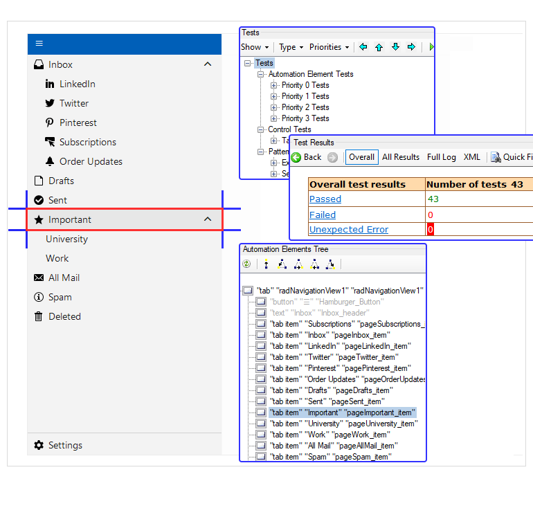

# UI Automation Support

With the Q3 2024 version of our controls, RadNavigationView supports UI Automation. The current implementation of UI Automation for RadNavigationView is similar to the MS WinForms TabControl implementation with some extended functionality. The main goal of this implementation is to ensure compliance with accessibility standards and to provide a common practice for automated testing. 

This functionality is enabled by default. To disable it, you can set the __EnableUIAutomation__ property to false.

<snippet id='navigationview-navigationview-enableuiautomation-cs' />
<snippet id='navigationview-navigationview-enableuiautomation-vb' />

## Relevant Properties 

The table below outlines the __UI Automation__ properties most important for understanding and interacting with RadNavigationView control.

#### RadNavigationView 

* AutomationElementIdentifiers.AutomationIdProperty.Id 
* AutomationElementIdentifiers.IsKeyboardFocusableProperty.Id 
* AutomationElementIdentifiers.NameProperty.Id 
* AutomationElementIdentifiers.LabeledByProperty.Id 
* AutomationElementIdentifiers.ControlTypeProperty.Id => ControlType.Tab.Id 
* AutomationElementIdentifiers.LocalizedControlTypeProperty.Id => "tab" 
* AutomationElementIdentifiers.IsContentElementProperty.Id 
* AutomationElementIdentifiers.IsControlElementProperty.Id 
* AutomationElementIdentifiers.OrientationProperty.Id 
* AutomationElementIdentifiers.ClassNameProperty.Id 
* AutomationElementIdentifiers.IsEnabledProperty.Id 
* AutomationElementIdentifiers.HasKeyboardFocusProperty.Id 
* AutomationElementIdentifiers.IsSelectionPatternAvailableProperty.Id 
* AutomationElementIdentifiers.IsExpandCollapsePatternAvailableProperty.Id 

#### Hamburger Button Element
 
* AutomationElementIdentifiers.NameProperty.Id 
* AutomationElementIdentifiers.AutomationIdProperty.Id => "Hamburger_Button" 
* AutomationElementIdentifiers.LocalizedControlTypeProperty.Id => "button" 
* AutomationElementIdentifiers.ControlTypeProperty.Id => ControlType.Button.Id 
* AutomationElementIdentifiers.IsControlElementProperty.Id 
* AutomationElementIdentifiers.IsContentElementProperty.Id 
* AutomationElementIdentifiers.ClassNameProperty.Id 
* AutomationElementIdentifiers.HelpTextProperty.Id 
* AutomationElementIdentifiers.IsInvokePatternAvailableProperty.Id 
* AutomationElementIdentifiers.ClickablePointProperty.Id 
* AutomationElementIdentifiers.IsEnabledProperty.Id 

#### Navigation View Items

* AutomationElementIdentifiers.AutomationIdProperty.Id => this.owner.Page.Name + "_item" 
* AutomationElementIdentifiers.NameProperty.Id 
* AutomationElementIdentifiers.ClickablePointProperty.Id 
* AutomationElementIdentifiers.LabeledByProperty.Id 
* AutomationElementIdentifiers.ControlTypeProperty.Id => ControlType.TabItem.Id 
* AutomationElementIdentifiers.LocalizedControlTypeProperty.Id => "tab item" 
* AutomationElementIdentifiers.IsControlElementProperty.Id 
* AutomationElementIdentifiers.IsContentElementProperty.Id 
* AutomationElementIdentifiers.IsKeyboardFocusableProperty.Id 
* AutomationElementIdentifiers.ClassNameProperty.Id 
* AutomationElementIdentifiers.IsEnabledProperty.Id 
* AutomationElementIdentifiers.HasKeyboardFocusProperty.Id 
* AutomationElementIdentifiers.IsSelectionItemPatternAvailableProperty.Id 

## Supported Control Patterns

The following section outlines the supported automation patterns for the __RadNavigationView__ control and its constituent elements.

#### RadNavigationView

* [Selection Control Pattern](https://learn.microsoft.com/en-us/windows/win32/winauto/uiauto-implementingselection)
* [ExpandCollapse Control Pattern](https://learn.microsoft.com/en-us/windows/win32/winauto/uiauto-implementingexpandcollapse)
* [Scroll Control Pattern](https://learn.microsoft.com/en-us/windows/win32/winauto/uiauto-implementingscroll)

#### Hamburger Button Element

* [Invoke Control Pattern](https://learn.microsoft.com/en-us/windows/win32/winauto/uiauto-implementinginvoke)

#### Navigation View Items

* [SelectionItem Control Pattern](https://learn.microsoft.com/en-us/windows/win32/winauto/uiauto-implementingselectionitem)
* [ExpandCollapse Control Pattern](https://learn.microsoft.com/en-us/windows/win32/winauto/uiauto-implementingexpandcollapse)

## Custom Automation Provider

The __RadNavigationView__ control expose CreateUIAutomationProvider() method that can be overriden to replace the default RadNavigationViewUIAutomationProvider class with your own implementation of the __IRawElementProviderFragmentRoot__ interface.

<snippet id='navigationview-navigationview-customuiautomationprovider-cs' />
<snippet id='navigationview-navigationview-customuiautomationprovider-vb' />

## See Also

* [Navigation View]()	 
* [Getting Started]()
* [Structure]()

