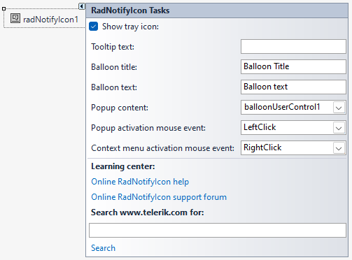
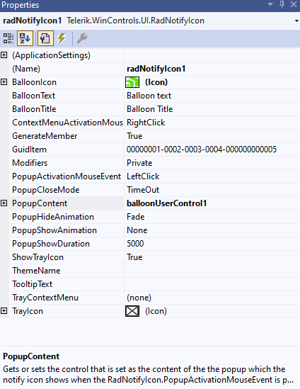

# Design Time

To start using __RadNotifyIcon__, just drag it from the toolbox and drop it onto the form. It will be placed in the components tray.

## Smart Tag

Select __RadNotifyIcon__ and click the small arrow on the top right position in order to open the Smart Tag.

It is possible to associate any control available on the form. UserControls are also supported. Just set the __Popup content__ property from the Smart Tag.

* __Show tray icon__: Specify whether the icon is visible in the notification area.
* __Tooltip text__: Specify the tooltip that will be shown when the mouse hovers over the notify icon.
* __Balloon title__: Specify the title of the balloon tip to be show when the RadNotifyIcon.ShowBalloonTip(int) method is called.
* __Balloon text__: Specify the text of the balloon tip to be show when the RadNotifyIcon.ShowBalloonTip(int) method is called.
* __Popup activation mouse event__: Specify the mouse action that must be performed over the notify icon to show a popup with RadNotifyIcon.PopupContent.
* __Context menu activation mouse event__: Specify the mouse action that must be performed over the notify icon to show the RadNotifyIcon.TrayContextMenu.

* __Learning Center__: Navigate to the Telerik help, code library projects or support forum.

* __Search__: Search the Telerik site for a given string.

## Design Time Properties

__RadNotifyIcon__ allows popup animation, duration and other properties at design time:

## See Also

* [Tooltip]()

