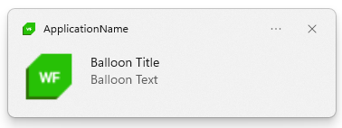
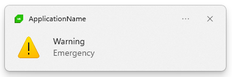

# Balloon Notifications

With the __RadNotifyIcon__ you can show a notification allowing you to display a message or prompt the user for some action.

## Balloon Notification Properties

The RadNotifyIcon exposes the following properties for controlling the look of the notification:

* __BalloonTitle__: Gets or sets the title of the balloon tip.
* __BalloonText__: Gets or sets the text of the balloon tip.
* __BalloonIcon__: A property of type __System.Drawing.Icon__ that gets or sets the icon of the balloon tip.

<!-- -->
>tip Use an .ico file with bigger dimensions (Width/Height) as Windows can scale it down, however it will not be scaled up, if it is less than the default size. 

{{source=..\SamplesCS\NotifyIcon\Features.cs region=Balloon}} 
{{source=..\SamplesVB\NotifyIcon\Features.vb region=Balloon}}
````C#

void ShowBallonNotification()
{
    RadNotifyIcon radNotifyIcon = new RadNotifyIcon();
    radNotifyIcon.TrayIcon = new System.Drawing.Icon("../../WinForms128x28.ico");
    radNotifyIcon.BalloonIcon = new System.Drawing.Icon("../../WinForms128x28.ico");
    radNotifyIcon.ShowTrayIcon = true;
    radNotifyIcon.BalloonText = "Balloon Text";
    radNotifyIcon.BalloonTitle = "Balloon Title";
    radNotifyIcon.ShowBalloonTip();
}

````
````VB.NET

Private Sub ShowBallonNotification()
    Dim radNotifyIcon As RadNotifyIcon = New RadNotifyIcon()
    radNotifyIcon.TrayIcon = New System.Drawing.Icon("../../WinForms128x28.ico")
    radNotifyIcon.BalloonIcon = New System.Drawing.Icon("../../WinForms128x28.ico")
    radNotifyIcon.ShowTrayIcon = True
    radNotifyIcon.BalloonText = "Balloon Text"
    radNotifyIcon.BalloonTitle = "Balloon Title"
    radNotifyIcon.ShowBalloonTip()
End Sub


```` 

{{endregion}}


#### __Figure 1: Balloon Notification__



## ShowBalloonTip Overloads

Here are the overloads exposed by the ShowBallonTip method:

* **void ShowBalloonTip(int timeout = 10)**: This overload uses the __BalloonTitle__, __BalloonText__ and the icon provided by __BalloonIcon__/__BalloonIconSource__ properties to show a notification. Optionally an integer can be passed to specify the amount of seconds to wait before the balloon auto hides (The system minimum and maximum are 10 and 30 seconds).

* **void ShowBalloonTip(string title, string text, BalloonTipIcon icon, bool doNotPlaySound = false, int timeout = 10)**: This overload allows for passing a title, text and choosing an icon from the set of standardized icons. Optionally you can specify whether sound should be played and the amount of seconds to wait before the balloon auto hides (The system minimum and maximum are 10 and 30 seconds). 

{{source=..\SamplesCS\NotifyIcon\Features.cs region=BalloonWarning}} 
{{source=..\SamplesVB\NotifyIcon\Features.vb region=BalloonWarning}}
````C#

this.radNotifyIcon.ShowBalloonTip("Warning", "Emergency", BalloonTipIcon.Warning, false, 15);

````
````VB.NET

Me.radNotifyIcon.ShowBalloonTip("Warning", "Emergency", BalloonTipIcon.Warning, False, 15)


```` 

{{endregion}}

#### __Figure 2: Warning Notification__



* **void ShowBalloonTip(string title, string text, System.Drawing.Icon icon, bool doNotPlaySound = false, int timeout = 10)**: This overload allows for passing a title, text and a __System.Drawing.Icon__ instance. Optionally you can specify whether sound should be played and the amount of seconds to wait before the balloon auto hides (The system minimum and maximum are 10 and 30 seconds). 

{{source=..\SamplesCS\NotifyIcon\Features.cs region=BalloonCustomIcon}} 
{{source=..\SamplesVB\NotifyIcon\Features.vb region=BalloonCustomIcon}}
````C#

var icon = new System.Drawing.Icon("../../WinForms128x28.ico");
this.radNotifyIcon.ShowBalloonTip("Balloon Title", "Balloon Text", icon, false, 15);


````
````VB.NET

Dim icon = New System.Drawing.Icon("../../WinForms128x28.ico")
Me.radNotifyIcon.ShowBalloonTip("Balloon Title", "Balloon Text", icon, False, 15)


```` 

{{endregion}}

## Hide the Notification

You can manually hide the notification by invoking the __HideBalloonTip__ method.

{{source=..\SamplesCS\NotifyIcon\Features.cs region=HideBallon}} 
{{source=..\SamplesVB\NotifyIcon\Features.vb region=HideBallon}}
````C#

this.radNotifyIcon.HideBalloonTip();

````
````VB.NET

Me.radNotifyIcon.HideBalloonTip()


```` 

{{endregion}}


