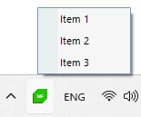

# ContextMenu

You can display a context menu when the user interacts with the notify icon with the help of the __TrayContextMenu__ property. 

## TrayContextMenu

The __TrayContextMenu__ property expects a value of type [RadContextMenu](). __Example 1__ demonstrates how it can be used. 

{{source=..\SamplesCS\NotifyIcon\Features.cs region=TrayContextMenu}} 
{{source=..\SamplesVB\NotifyIcon\Features.vb region=TrayContextMenu}}
````C#

void SetContextMenu()
{
	RadNotifyIcon radNotifyIcon = new RadNotifyIcon();
	radNotifyIcon.TrayIcon = new System.Drawing.Icon("../../WinForms128x28.ico");
	radNotifyIcon.ContextMenuActivationMouseEvent = MouseActivationEvent.RightClick;
	radNotifyIcon.ShowTrayIcon = true;
	radNotifyIcon.PopupContent = new UserControl1();          
	var contextMenu = new RadContextMenu();
	contextMenu.Items.Add(new RadMenuItem("Item 1"));
	contextMenu.Items.Add(new RadMenuItem("Item 2"));
	contextMenu.Items.Add(new RadMenuItem("Item 3"));
	radNotifyIcon.TrayContextMenu = contextMenu;
}

````
````VB.NET

Private Sub SetContextMenu()
	Dim radNotifyIcon As RadNotifyIcon = New RadNotifyIcon()
    radNotifyIcon.TrayIcon = New System.Drawing.Icon("../../WinForms128x28.ico")
    radNotifyIcon.ContextMenuActivationMouseEvent = MouseActivationEvent.RightClick
    radNotifyIcon.ShowTrayIcon = True
    radNotifyIcon.PopupContent = New UserControl1()
    Dim contextMenu = New RadContextMenu()
    contextMenu.Items.Add(New RadMenuItem("Item 1"))
    contextMenu.Items.Add(New RadMenuItem("Item 2"))
    contextMenu.Items.Add(New RadMenuItem("Item 3"))
    radNotifyIcon.TrayContextMenu = contextMenu
End Sub


```` 

{{endregion}}

#### __Figure 1: RadContextMenu displayed over the icon__



## ContextMenuActivationMouseEvent

The __ContextMenuActivationMouseEvent__ property determines when the context menu will be shown. The default value is __RightClick__. This property is enumeration and it expose the following values:
* __LeftClick__: Triggered on left mouse click.
* __RightClick__: Triggered on right mouse click.
* __MiddleClick__: Triggered on middle mouse click.
* __LeftDoubleClick__: Triggered on left mouse double click.
* __RightDoubleClick__: Triggered on right mouse double click.
* __MiddleDoubleClick__: Triggered on middle mouse double click.
* __All__: Triggered on any mouse click action.

{{source=..\SamplesCS\NotifyIcon\Features.cs region=ContextMenuActivationMouseEvent}} 
{{source=..\SamplesVB\NotifyIcon\Features.vb region=ContextMenuActivationMouseEvent}}
````C#

radNotifyIcon.ContextMenuActivationMouseEvent = MouseActivationEvent.MiddleClick;

````
````VB.NET

radNotifyIcon.ContextMenuActivationMouseEvent = MouseActivationEvent.MiddleClick


```` 

{{endregion}}

