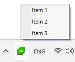

# ContextMenu

You can display a context menu when the user interacts with the notify icon with the help of the __TrayContextMenu__ property. 

## TrayContextMenu

The __TrayContextMenu__ property expects a value of type [RadContextMenu](). __Example 1__ demonstrates how it can be used. 

<snippet id='notifyicon-features-traycontextmenu-cs' />
<snippet id='notifyicon-features-traycontextmenu-vb' />

#### __Figure 1: RadContextMenu displayed over the icon__

## ContextMenuActivationMouseEvent

The __ContextMenuActivationMouseEvent__ property determines when the context menu will be shown. The default value is __RightClick__. This property is enumeration and it expose the following values:
* __LeftClick__: Triggered on left mouse click.
* __RightClick__: Triggered on right mouse click.
* __MiddleClick__: Triggered on middle mouse click.
* __LeftDoubleClick__: Triggered on left mouse double click.
* __RightDoubleClick__: Triggered on right mouse double click.
* __MiddleDoubleClick__: Triggered on middle mouse double click.
* __All__: Triggered on any mouse click action.

<snippet id='notifyicon-features-contextmenuactivationmouseevent-cs' />
<snippet id='notifyicon-features-contextmenuactivationmouseevent-vb' />

