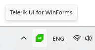

# Tooltip

You can configure the tooltip that is displayed when the user hovers over the icon with the **TooltipText** property. The string set to this property will be shown as a content of the tooltip.

<snippet id='notifyicon-features-tooltip-cs' />
<snippet id='notifyicon-features-tooltip-vb' />

#### __Figure 1: RadNotifyIcon with Tooltip__

